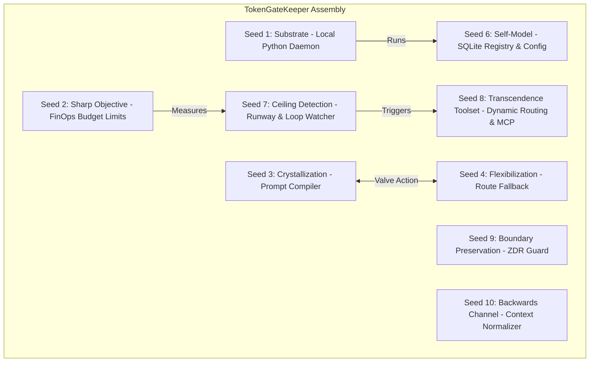

# TokenGateKeeper: Autonomous Entity Architecture (AEA) Integration Blueprint

TokenGateKeeper is not just a utility wrapper; it is a client-side implementation of the **Autonomous Entity Architecture (AEA)** detailed across `luisblanco.dev`. By providing a localized proxy daemon, a unified memory store, and a dynamic orchestration engine, it embodies the core AEA thesis: **"Autonomy lives in the assembly, not the model" (Law 2)**.

This blueprint maps the structural mechanisms of TokenGateKeeper directly to the ten seeds, three verbs, and four ops of the AEA framework.

---

## 1. Mapping the Ten AEA Seeds to TokenGateKeeper

A seed is a minimum load-bearing organ; removing any single seed causes the system's operational autonomy to collapse. Here is how TokenGateKeeper materializes each seed:

### SEED 1 · substrate (The Runtime Platform)
*   *AEA Definition*: The hardware and node the entity runs on.
*   *TokenGateKeeper Mechanism*: The local Python 3.11+ environment (`FastAPI + SQLite`) operating on the developer's local machine. By keeping execution local, it ensures absolute privacy and local auditability of all outbound API requests.

### SEED 2 · sharp objective (Falsifiable Target)
*   *AEA Definition*: A goal the system can validate its performance against.
*   *TokenGateKeeper Mechanism*: Cost and latency minimization (FinOps). The objective is to maximize $S_{\text{cumulative}}$ (savings) while maintaining structural correctness of LLM generated code outputs.

### SEED 3 · crystallization capability (The Code Compiler)
*   *AEA Definition*: Freezing repeated model behavior into deterministic code.
*   *TokenGateKeeper Mechanism*: The **Crystallization Engine**. When the loop detector identifies high-frequency, low-level prompts, it compiles them into local Python/Bash scripts inside `~/.token_gatekeeper/scripts/`, reducing model call costs and output latency to zero.

### SEED 4 · flexibilization capability (The API Fallback)
*   *AEA Definition*: Falling back to the model when code meets novelty.
*   *TokenGateKeeper Mechanism*: The **Capability Matchmaker**. When a local crystallized script fails execution (throws non-zero exit code) or receives inputs outside its regex schema scope, the proxy dynamically routes the task back to the external LLM pipeline.

### SEED 5 · self-versioning capability (Out-of-Place Synthesis)
*   *AEA Definition*: Building a successor next to the running version.
*   *TokenGateKeeper Mechanism*: When updating a crystallized tool, the proxy writes the updated script to a unique file path (`[script_id]_v2.py`) and validates it in a sandbox. The active proxy swaps the execution routes only after successful sandbox verification, ensuring zero runtime interruptions.

### SEED 6 · self-model (System Registry)
*   *AEA Definition*: System-awareness (what components are built and active).
*   *TokenGateKeeper Mechanism*: The SQLite database and configurations detailing active model keys, pricing profiles, registered crystallized script regex triggers, and active sub-MCP server mappings.

### SEED 7 · ceiling detection (Metric Watchers)
*   *AEA Definition*: The meta-sensor recognizing stagnation or runaway optimization loops.
*   *TokenGateKeeper Mechanism*: The **Runaway Loop Watcher** tracking hourly spend rates and sequential query intervals. It triggers visual alerts via the avatar when budget limits or rate thresholds are breached.

### SEED 8 · transcendence toolset (The Transition Mechanisms)
*   *AEA Definition*: The repertoire of moves used to resolve a detected ceiling.
*   *TokenGateKeeper Mechanism*: Dynamic routing modifications (e.g., swapping a throttled endpoint for a free NVIDIA NIM target) and the hot-swappable MCP tool loader.

### SEED 9 · boundary preservation (Safety Invariants)
*   *AEA Definition*: The forbidden-mutation list with strict enforcement.
*   *TokenGateKeeper Mechanism*: The **Zero Data Retention (ZDR) Shield**. Hardcoded regex filters and compliance rules that block queries from routing to non-ZDR servers (like Claude Fable 5) if corporate IP keywords are parsed.

### SEED 10 · persistent backwards channel (Session Normalization)
*   *AEA Definition*: Handover between version generations that never closes.
*   *TokenGateKeeper Mechanism*: **Context Normalization**. During mid-session model swaps (e.g., moving from OpenAI to NVIDIA NIM due to rate limiting), the proxy normalizes conversation histories, system messages, and schemas to ensure continuity without context breakages.

---

## 2. The Three Verbs: Compose, Propagate, Observe

The mechanics are the runtime verbs detailing the operational loops of the gateway:

1.  **COMPOSE**: The Orchestrator integrates disparate client interfaces (Cursor custom URLs, Web UI scripts, Cline configurations) into a unified local gateway connected to a singular database and key catalog.
2.  **PROPAGATE**: Outgoing prompts carry token counters, budget evaluations, and metaprompts, flowing changes seamlessly across models. Inbound streams propagate cost logs directly to the SQLite registry.
3.  **OBSERVE**: The tokenizers (`tiktoken`) evaluate inputs pre-flight. Real-time metrics are streamed via WebSockets to animate the **FinOps Capybara** dashboard overlay.

---

## 3. The Four Ops: Designing the Lifecycle

The developer operates around the system following the AEA operational cycle:

*   **DESIGN**: The developer defines their budget constraints, configures API keys, and locates targets on the coordinate grid (selecting model tiers from Nemotron-Nano up to Nemotron-Ultra).
*   **TIME**: Running processes are timed against call budgets and sliding-window rate limit buckets (delaying calls when approaching the 40 RPM NVIDIA NIM sandbox limits).
*   **SHIP**: Crystallized scripts are executed and validated within sandboxed containers before production registration.
*   **LEARN**: The developer audits the telemetry ledger, observing the cumulative savings ledger $S_{\text{cumulative}}$ and adapting the routing matrix to harvest emerging free hosted endpoints.
