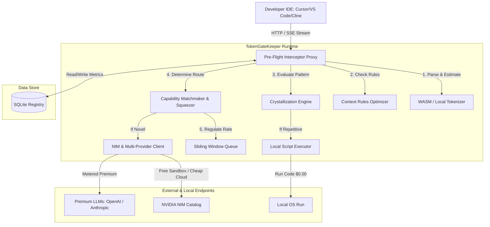

# TokenGateKeeper: Master System Architecture Specification

## 1. System Overview & Core Objective
TokenGateKeeper is a local proxy daemon designed to intercept, analyze, optimize, and dynamically route Large Language Model (LLM) requests. Its core purpose is to eradicate cognitive friction and financial leakage in AI-assisted developer workflows. By operating as a middleman on `localhost`, it provides a gateway that acts as a client-side cost gatekeeper and orchestrator, routing tasks to local models or cheap, high-performance sandboxes (such as NVIDIA NIM free endpoints) before incurring premium cloud costs.



---

## 2. API Proxy Mechanics & Interception Layer
TokenGateKeeper runs as a background process exposing standard endpoints mimicking OpenAI and Anthropic API schemas.

### 2.1 Supported API Contracts
*   **OpenAI Compatibility Paths**:
    *   `POST /v1/chat/completions` (Supports standard completions and SSE `text/event-stream` chunks).
    *   `GET /v1/models` (Exposes target routing endpoints and alias list).
*   **Anthropic Compatibility Paths**:
    *   `POST /v1/messages` (Intercepts and translates prompt structure to internal representations).

### 2.2 IDE Configuration Setup
To integrate the interceptor, the developer sets the API endpoint of their client extensions or IDEs to redirect to TokenGateKeeper:
*   **Cursor/Windsurf (Custom API Key / Base URL)**:
    *   OpenAI Base URL: `http://localhost:8080/v1`
    *   API Key: Placeholder value or local auth token.
*   **Cline / Roo Code (VS Code Extension)**:
    *   Select provider: `OpenAI Compatible` or `API Gateway`
    *   Base URL: `http://localhost:8080/v1`

---

## 3. SQLite Database Schema
The daemon maintains state locally using an SQLite database (`~/.token_gatekeeper/ledger.db`). It records transaction telemetry, pricing sheets, rate limit history, and active dynamic routes.

```sql
-- Core transaction table for FinOps auditing
CREATE TABLE IF NOT EXISTS transactions (
    id TEXT PRIMARY KEY,
    timestamp DATETIME DEFAULT CURRENT_TIMESTAMP,
    client_app TEXT,                  -- cursor, cline, terminal-cli
    prompt_hash TEXT,                 -- SHA-256 hash of system + user message
    original_model TEXT,              -- e.g., claude-3-5-sonnet
    routed_model TEXT,                -- e.g., nvidia/nemotron-3-ultra-550b-a55b
    input_tokens INTEGER NOT NULL,
    output_tokens INTEGER,
    estimated_cost REAL NOT NULL,     -- projected cost of original model in USD
    actual_cost REAL NOT NULL,        -- cost of the actual routed model in USD
    savings REAL NOT NULL,            -- estimated_cost - actual_cost
    status TEXT NOT NULL              -- BLOCKED, SUCCESS, REROUTED, FAILED
);

-- Store model configurations and pricing
CREATE TABLE IF NOT EXISTS model_pricing (
    model_id TEXT PRIMARY KEY,
    provider TEXT NOT NULL,           -- nvidia, anthropic, openai, local
    input_token_price_per_m REAL,     -- in USD
    output_token_price_per_m REAL,    -- in USD
    is_active INTEGER DEFAULT 1
);

-- Store crystallized scripts generated by the loop detector
CREATE TABLE IF NOT EXISTS crystallized_scripts (
    script_id TEXT PRIMARY KEY,
    created_at DATETIME DEFAULT CURRENT_TIMESTAMP,
    name TEXT NOT NULL,
    description TEXT,
    prompt_pattern TEXT NOT NULL,     -- regex or structural trigger content
    script_path TEXT NOT NULL,        -- absolute path to generated python script
    invocation_count INTEGER DEFAULT 0
);
```

---

## 4. Lifecycle of a Request
1.  **Interception**: An outgoing API request hits `http://localhost:8080/v1/chat/completions`.
2.  **Telemetry Logging**: Prompt payloads are parsed and a transaction log record is initialized with status `PENDING`.
3.  **Token Counting**: The input text is tokenized client-side using `tiktoken` (for OpenAI format) to determine size.
4.  **Crystallization Scan**: The request is compared with the database of `crystallized_scripts`. If a structural match is found, the proxy intercepts completely, executes the script locally, maps the stdout to a completion schema, and returns it (API call bypassed).
5.  **FinOps Validation**: If no script matches, the estimated cost is computed. If cost exceeds the threshold limit, it responds with a HTTP `403 Forbidden` carrying structural cost alerts.
6.  **Intent Classification & Routing**: The proxy parses the task type. Trivial tasks (documentation, formatting, refactoring imports) are routed to local models or lightweight NIM endpoints. Deep architecture planning and security checks are routed to high-tier models.
7.  **Squeezing**: Prompts routed to cheaper endpoints are dynamically wrapped with formatting and few-shot metaprompt structures.
8.  **Rate-Limit Management**: The sliding-window queue regulates requests to prevent API provider saturation.
9.  **Execution & Telemetry Update**: The request is sent to the target endpoint. For streams, response chunks are read, token count accumulated, and savings logged to the SQLite database upon completion.

---

## 5. Avatar Integration Layer & Telemetry WebSockets

To power the real-time animations, expressions, and prompts of the Ambient FinOps Avatar, TokenGateKeeper implements an active WebSocket pub/sub engine and browser content-script injection schema.

### 5.1 Real-Time WebSocket Channel
The FastAPI proxy server exposes a WebSocket endpoint at `ws://localhost:8080/telemetry`:
*   **Clients**: The browser extension, Tampermonkey scripts, and local desktop widgets connect to this socket.
*   **Events Dispatched (Server -> Client)**:
    *   `token_estimate`: Informs the client of estimated input token size and cost for the active buffer.
    *   `budget_update`: Informs the client of daily cumulative spend, savings, and remaining runway $R_t$.
    *   `runaway_alert`: Sent when sequential request frequency breaches safety thresholds.
    *   `state_change`: Signals the avatar to swap its visual persona (e.g. `CALM` -> `PUZZLED` -> `PANIC` -> `SHIELD`).

### 5.2 Content Script Injection Mechanics
For browser-based interfaces (such as Claude's chat window), a lightweight web extension or userscript performs DOM injection:
1.  **Input Selector Watcher**: Listens to changes in the prompt textarea (e.g., `[contenteditable="true"]` or `textarea`).
2.  **Debounced Payload Dispatch**: Debounces text inputs (300ms) and dispatches the raw text payload to `POST http://localhost:8080/v1/preflight/estimate` or sends it over the active WebSocket channel.
3.  **UI Modification**: Injects a custom gold button `[Send via NIM]` directly next to the page's original submit button. Clicking this button overrides the default page submission and routes the prompt via the local gateway proxy instead.

