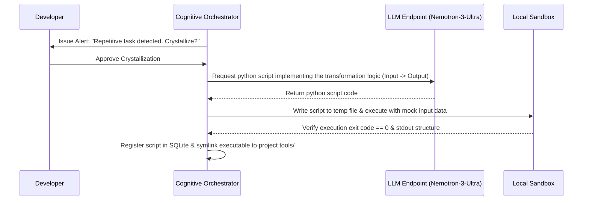

# TokenGateKeeper: Crystallization Engine Specification

The Crystallization Engine is the local automation subsystem of TokenGateKeeper. Its purpose is to detect when a developer is repeatedly using expensive LLM queries to perform identical, low-level, or deterministic formatting and translation operations, and compile those operations into local, zero-cost Python or Bash scripts. 

By replacing probabilistic model routing with deterministic local scripts, the system reduces execution latency to $\sim 10\text{ms}$ and cuts token consumption to $0$.

---

## 1. Loop Detection Pipeline

The Cognitive Orchestrator runs a background thread that periodically analyzes the SQLite `transactions` history using a three-step detection sequence:

```
[Transaction History] ──► [1. Structural Normalization] ──► [2. Clustering Scanner] ──► [3. Cost Threshold Alert]
```

### 1.1 Structural Normalization
Before evaluating similarity, prompts are normalized to extract their core template logic:
1.  Strip specific user data (concrete filenames, string constants, variable names).
2.  Replace variables with structural tokens (e.g., `<PATH>`, `<VAR>`, `<NUMBER>`).
3.  Compute the normalized prompt string.

*Example:*
*   *Original*: `Parse the server logs at C:/logs/error.log and extract all lines containing 'NullPointerException'`
*   *Normalized*: `Parse the server logs at <PATH> and extract all lines containing <STRING>`

### 1.2 Clustering & Similarity Scanner
The engine clusters normalized prompts using a fast TF-IDF character n-gram matcher. 
*   **Similarity Threshold**: A similarity score of $Sim(A, B) \geq 0.85$ indicates a match.
*   **Frequency Trigger**: If a normalized pattern is executed $\ge 5$ times in a rolling 24-hour window, the engine flags it for crystallization.

---

## 2. Compilation and Code Synthesis

Once a pattern is flagged, the Orchestrator initiates compilation:



### 2.1 The Script Generator Prompt
When compiling, the Orchestrator sends a specialized synthesis query to `nvidia/nemotron-3-ultra-550b-a55b`:

```markdown
You are a compiler writing a standalone, deterministic Python 3 script.
Your task is to replace a repetitive LLM text-transformation request with a local Python script.

=== SPECIFICATION ===
Input format: [User's raw arguments passed via CLI parameters]
Output format: [Parsed structured string printed to stdout]

=== GENERATION RULES ===
1. Generate complete, executable Python code.
2. Use ONLY Python standard library modules (sys, os, json, re, csv). Do NOT import external dependencies.
3. Include argument parsing using `argparse`.
4. Include comprehensive try/except blocks. If an error occurs, write to stderr and exit with non-zero code.
5. Do NOT output markdown chat wrapping other than the code block:
```python
# python code here
```
```

---

## 3. Local Script Invocation & Registry

A crystallized script is stored in `~/.token_gatekeeper/scripts/[script_id].py`. 

### 3.1 SQLite Schema Entry
```sql
INSERT INTO crystallized_scripts (script_id, name, description, prompt_pattern, script_path)
VALUES (
    'parse_server_logs_3f8a',
    'Log Parser',
    'Extracts lines containing a specific keyword from a log file.',
    '^Parse the server logs at (.+) and extract all lines containing (.+)$',
    'C:/Users/Luis.Blanco/.token_gatekeeper/scripts/parse_server_logs_3f8a.py'
);
```

### 3.2 Interception Routine
When the Pre-Flight Interceptor catches a prompt, it matches the text against registered regex `prompt_pattern` templates. If a match is found:
1.  The proxy extracts regex capture groups (arguments).
2.  It executes the script locally:
    ```bash
    python C:/Users/Luis.Blanco/.token_gatekeeper/scripts/parse_server_logs_3f8a.py --file arg1 --query arg2
    ```
3.  The stdout is captured and wrapped into an OpenAI completion JSON response:
    ```json
    {
      "id": "chatcmpl-local-crystallized",
      "object": "chat.completion",
      "created": 1718257000,
      "model": "local-crystallized",
      "choices": [{
        "index": 0,
        "message": {
          "role": "assistant",
          "content": "[STDOUT FROM SCRIPT]"
        },
        "finish_reason": "stop"
      }]
    }
    ```
4.  The completed transaction is stored in the database with `savings = $C_{original}` and `actual_cost = $0.00`.
