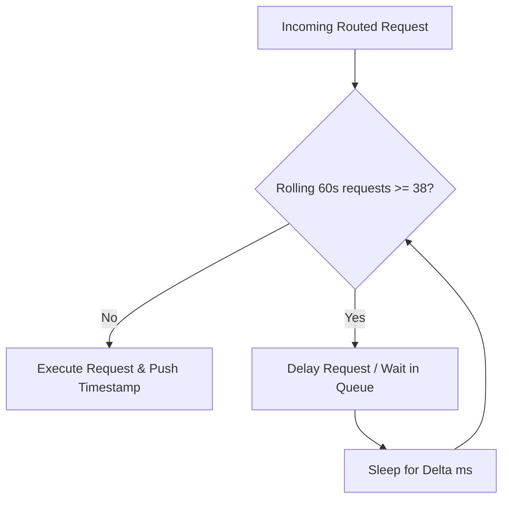

# TokenGateKeeper: FinOps Ledger & Telemetry Specification

TokenGateKeeper operates a real-time tracking engine calculating token volume, pricing projections, dynamic runway metrics, and rate limit protections. This document details the mathematical models and structural rules governing these calculations.

---

## 1. Real-Time Financial Ledger

The system tracks cumulative financial efficiency to validate cost containment and prove developer savings compared to default premium model selections (e.g., routing everything to Claude 3.5 Sonnet).

### 1.1 Cumulative Savings Formula
The Savings Tracker ($S_{\text{cumulative}}$) accumulates the savings of each transaction over the active session duration ($T$):

$$S_{\text{cumulative}} = \sum_{j=1}^{T} \left( C_{\text{projected}, j} - C_{\text{actual}, j} \right)$$

Where:
*   $T$ is the total number of intercepted transactions.
*   $C_{\text{projected}, j}$ is the projected financial cost of transaction $j$ had it been sent to the default premium model:
    $$C_{\text{projected}, j} = \left( I_j \cdot P_{\text{in, premium}} + O_j \cdot P_{\text{out, premium}} \right) \times 10^{-6}$$
*   $C_{\text{actual}, j}$ is the actual financial cost of the transaction based on the target routed endpoint (e.g., Free NVIDIA NIM sandboxes or local quantized models costing $\$0.00$):
    $$C_{\text{actual}, j} = \left( I_j \cdot P_{\text{in, routed}} + O_j \cdot P_{\text{out, routed}} \right) \times 10^{-6}$$
*   $I_j, O_j$ represent the input and output token count of transaction $j$.
*   $P_{\text{in}}, P_{\text{out}}$ represent the unit price per million input/output tokens.

---

## 2. Dynamic Spend Runway Projection

The Orchestrator projects the remaining active development hours ($R_t$) based on sliding-window consumption velocity:

$$R_t = \frac{B_{\text{remaining}}}{\sum_{i \in \mathcal{M}} \left( \overline{I}_i \cdot P_{\text{in}, i} + \overline{O}_i \cdot P_{\text{out}, i} \right) \cdot F_i \times 10^{-6}}$$

Where:
*   $B_{\text{remaining}}$ is the remaining user-allocated budget (in USD, retrieved from SQLite).
*   $\mathcal{M}$ is the active set of routed models.
*   $\overline{I}_i, \overline{O}_i$ are the sliding-window averages of input and output tokens consumed per call for model $i$ (calculated over the last 50 transactions).
*   $P_{\text{in}, i}, P_{\text{out}, i}$ represent the unit cost per million tokens for model $i$'s provider.
*   $F_i$ represents the frequency of model $i$ invocations per hour (calculated from transaction timestamps in the active session).

---

## 3. Pre-Flight Tokenization Engine

Token count estimation occurs client-side *before* outgoing network dispatch.

```
[Prompt Text] ──► [Select Encoding] ──► [WASM tiktoken / Native Tokenizer] ──► [Estimated Count]
```

### 3.1 Tokenizer Selection Mapping
1.  **OpenAI Routes**: Uses `tiktoken` with the `o200k_base` model encoding (for GPT-4o variants) or `cl100k_base` (for GPT-4 / GPT-3.5).
2.  **Anthropic Routes**: Uses a python wrapper mimicking the HuggingFace `anthropic-tokenizer` or maps to a tiktoken equivalent with a $+10\%$ token count offset buffer to prevent underestimation.
3.  **NVIDIA NIM Routes**: Uses standard llama/nemotron sub-token count scaling factors ($1\text{ word} \approx 1.33\text{ tokens}$).

---

## 4. Sliding-Window Rate Limiter Queue

NVIDIA NIM sandboxes impose a rate limit ceiling of **40 Requests Per Minute (RPM)**. To prevent request drops or API locks, the Orchestrator implements a token-bucket rate limiter:



*   **Queue Threshold**: 38 requests per 60 seconds (providing a buffer of 2 requests to absorb concurrent threads).
*   **Queue Behavior**: Request streams are held in a FIFO queue. If the rate limit is reached, execution blocks. The proxy releases requests sequentially as older timestamps slide out of the 60-second window.
