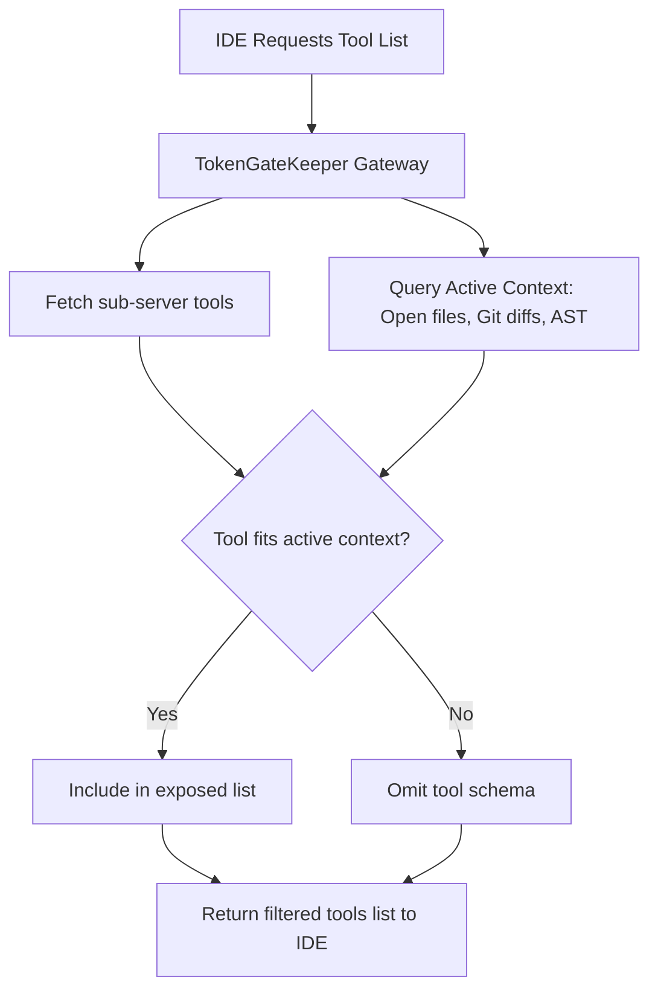

# TokenGateKeeper: MCP Gateway & TSI Shield Specification

The Model Context Protocol (MCP) allows IDEs to communicate with local and remote tools via a structured JSON-RPC channel. However, mounting dozens of tools simultaneously clutters the LLM's context window with irrelevant schemas, causing hallucinations, slower generation speeds, and high token costs.

This specification details the **Tool Space Interference (TSI) Shield**, a dynamic filter that intercepts the MCP schema exchanges and exposes only the tools required for the active workspace context.

---

## 1. Hot-Swappable MCP Gateway Architecture

Rather than connecting the IDE directly to multiple individual MCP servers, the IDE is configured to connect to a single host proxy: **TokenGateKeeper**. This proxy manages connections to sub-servers and acts as a dynamic tool registry.

```
+─────────────────+        +───────────────────────────────────+        +─────────────────────+
|  Developer IDE  |        |      TO K E N G A T E K E E P E R |        | Sub-MCP Server 1    |
|                 | ───►   |  - Persistent Host Connection     |  ───►  | (FileSystem)        |
|  Exposes:       | JSON-  |  - TSI Shield (Dynamic Filtering) |        +─────────────────────+
|  Single Gateway | RPC    |                                   |        +─────────────────────+
|  Connection     |        |  - Dynamic Sub-Server Registry    |  ───►  | Sub-MCP Server 2    |
|                 | ◄───   |                                   |        | (Crystallized Tools)|
+─────────────────+        +───────────────────────────────────+        +─────────────────────+
```

### 1.1 Key Advantage: No IDE Restarts
In standard IDE configurations, adding or updating an MCP tool requires restarting the IDE to reload the configuration. Because TokenGateKeeper acts as a proxy, new crystallized scripts or third-party MCP servers can be mounted, updated, or removed in-memory by TokenGateKeeper. The IDE's single connection remains alive, queryable, and dynamically updated.

---

## 2. Tool Space Interference (TSI) Shield Algorithm

The TSI Shield intercepts the `tools/list` JSON-RPC response from sub-servers and filters the schemas before returning them to the IDE.



### 2.1 Context Scopes & Mounting Rules
The gateway monitors the developer's local environment (via active file watchers or IDE status APIs) to dynamically determine the context state:

| Context Scope | Environmental Indicator | Mounted Tool Category | Suppressed Tool Category |
| :--- | :--- | :--- | :--- |
| **Database Dev** | `.sql` files open, or `sqlite` imports found in AST | SQLite execution tools, schema inspectors | Web search tools, server deployment commands |
| **Python Coding** | `.py` files open, or `requirements.txt` present | Python interpreter tools, poetry/pip runners | Node/NPM utilities, Docker management |
| **Frontend/Design** | `.html`, `.css`, `.tsx` files open | CSS/Layout generators, browser automation | Database migrations, git tag modifiers |
| **System Debug** | Active terminal errors, compile logs modified | Log parsers, process managers | Code formatters, template synthesizers |

---

## 3. JSON-RPC Protocol Interception

When the IDE dispatches a `tools/list` request, the proxy translates the response payload.

### 3.1 Raw Request Interception
```json
{
  "jsonrpc": "2.0",
  "method": "tools/list",
  "id": 1
}
```

### 3.2 Filtered Response Generation
If the developer is editing `index.html` and has no active Python files:
*   *Before Filtering (Raw sub-server data)*: Exposes `execute_python_script`, `run_git_diff`, `inspect_database_table`, `generate_css_layout`.
*   *After Filtering (Returned to IDE)*:
    ```json
    {
      "jsonrpc": "2.0",
      "result": {
        "tools": [
          {
            "name": "generate_css_layout",
            "description": "Synthesize a CSS styling layout.",
            "inputSchema": { ... }
          },
          {
            "name": "run_git_diff",
            "description": "Exposes local git difference.",
            "inputSchema": { ... }
          }
        ]
      },
      "id": 1
    }
    ```
By omitting `execute_python_script` and `inspect_database_table`, the context payload sent to the LLM is reduced by approximately **3,500 tokens** of tool schema descriptions, preventing tool-calling errors and saving token budget.
