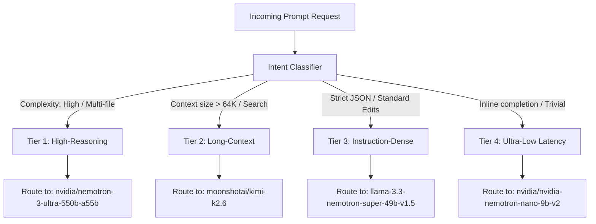

# TokenGateKeeper: NVIDIA NIM Catalog Routing Specification

NVIDIA’s NIM catalog (`build.nvidia.com`) provides a suite of hosted open-weight models accessible via a free endpoint sandbox. This specification details how the **Capability Matchmaker** classifies prompt intent and dynamically routes requests to the optimal NIM endpoint, maximizing performance while maintaining a cost of $0.00.

---

## 1. Supported Model Matrix

The router maps incoming requests to four primary NIM targets based on complexity, context size, and reasoning depth:

| Target NIM Identifier | Active Size / Architecture | Primary Strength | Use Case Routing |
| :--- | :--- | :--- | :--- |
| **`nvidia/nemotron-3-ultra-550b-a55b`** | 55B Active / 550B MoE (Mamba + Attention) | Frontier-grade reasoning, multi-file code synthesis, deep logic planning | Complex debugging, structural design generation, test suite writing |
| **`moonshotai/kimi-k2.6`** | State-of-the-Art MoE | Long-context understanding, high-precision document parsing | Workspace index scanning, full-file log analysis, large JSON mappings |
| **`llama-3.3-nemotron-super-49b-v1.5`** | 49B Dense / Instruction Optimized | High compliance, strict formatting, structured schema matching | Unit tests, JSON outputs, intermediate-level editing |
| **`nvidia/nvidia-nemotron-nano-9b-v2`** | 9B Hybrid (Mamba-2 + Transformer) | Ultra-low latency, basic syntax comprehension | Inline autocomplete, comments, simple explanations, formatting checks |

---

## 2. Intent Classification & Routing Matrix

The Capability Matchmaker parses the incoming API request body (system prompt, messages list, parameters) to classify it into one of four intent profiles:



### 2.1 Keyword & Heuristic Classification Rules
To avoid the cognitive latency of running an LLM for classification, the proxy uses a fast heuristic classifier scanning the message content, system prompts, and context weight:
*   **Tier 4 (Nemotron-Nano-9b-v2)**: 
    *   *Trigger*: Prompts requesting code explanation, formatting, adding comments, or message size $< 2,000$ characters and no complex logic keywords.
    *   *Key terms*: `explain this`, `add comments`, `format code`, `what does this function do`.
*   **Tier 3 (Llama-3.3-Nemotron-Super-49b)**:
    *   *Trigger*: Prompts requesting structured JSON response, translation, intermediate code generation, or single-file modifications.
    *   *Key terms*: `JSON`, `schema`, `convert to`, `write a test for`, `refactor this file`.
*   **Tier 2 (Kimi-k2.6)**:
    *   *Trigger*: Cumulative message history $> 64,000$ tokens or requests seeking multi-document lookups.
    *   *Key terms*: `search across all files`, `parse these logs`, `analyze the workspace`.
*   **Tier 1 (Nemotron-3-Ultra-550b)**:
    *   *Trigger*: Requests involving complex system design, cross-file architectural edits, algorithm optimization, or complex debugging loops.
    *   *Key terms*: `optimize algorithm`, `fix bug across files`, `redesign database structure`, `refactor repository architecture`.

---

## 3. Integration & Request Schemas

NVIDIA endpoints use standard OpenAI-compatible REST schemas, but accept advanced generation parameters for thinking capabilities.

### 3.1 Advanced NIM Settings
For the **Nemotron-3-Ultra-550B**, thinking capabilities are toggled via `extra_body` or custom fields:
*   `chat_template_kwargs`: `{"enable_thinking": true}` (Instructs the model to output a reasoning trace).
*   `reasoning_budget`: An integer specifying the maximum reasoning token budget (e.g., `16384`).

### 3.2 Raw cURL Protocol Example
```bash
curl https://integrate.api.nvidia.com/v1/chat/completions \
  -H "Authorization: Bearer $NVIDIA_API_KEY" \
  -H "Content-Type: application/json" \
  -d '{
    "model": "nvidia/nemotron-3-ultra-550b-a55b",
    "messages": [{"role": "user", "content": "Analyze the concurrency safety in this project."}],
    "temperature": 1.0,
    "top_p": 0.95,
    "max_tokens": 16384,
    "extra_body": {
      "chat_template_kwargs": {"enable_thinking": true},
      "reasoning_budget": 16384
    },
    "stream": true
  }'
```

### 3.3 Python Integration (Using langchain_nvidia_ai_endpoints)
When building custom agents, the python backend connects using NVIDIA’s official langchain integration:
```python
from langchain_nvidia_ai_endpoints import ChatNVIDIA

client = ChatNVIDIA(
    model="nvidia/nemotron-3-ultra-550b-a55b",
    api_key="your_nvidia_api_key",
    temperature=1.0,
    top_p=0.95,
    max_tokens=16384,
    reasoning_budget=16384,
    chat_template_kwargs={"enable_thinking": True}
)

# Stream responses separating thinking reasoning content
for chunk in client.stream([{"role": "user", "content": "Explain KV Cache optimization"}]):
    if chunk.additional_kwargs and "reasoning_content" in chunk.additional_kwargs:
        # Reasoning content output (printed separately or highlighted)
        print(chunk.additional_kwargs["reasoning_content"], end="")
    print(chunk.content, end="")
```
The client-side interceptor reads the streamed chunks and maps `reasoning_content` to standard visual indicators (e.g., collapsing thinking block components in the dashboard interface).
