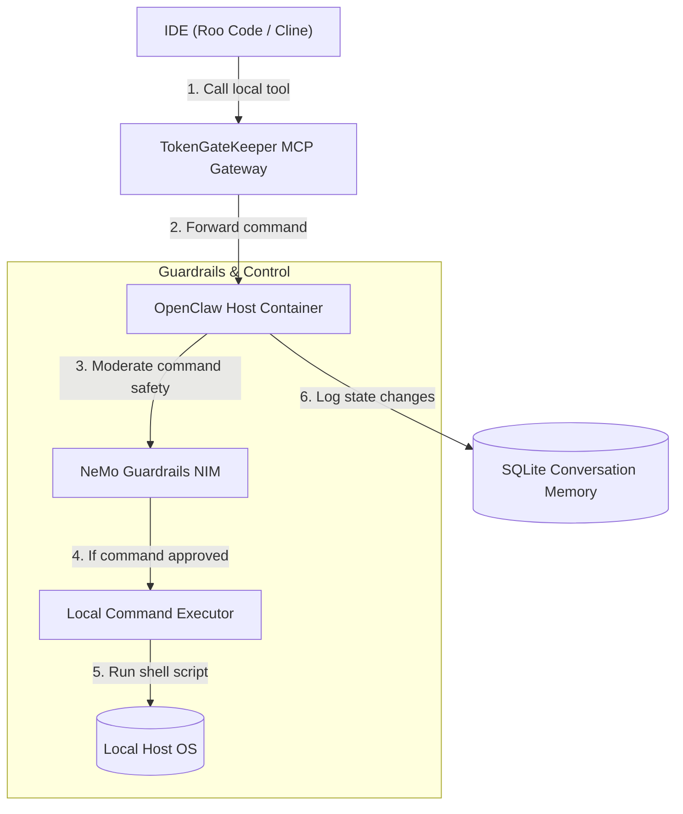
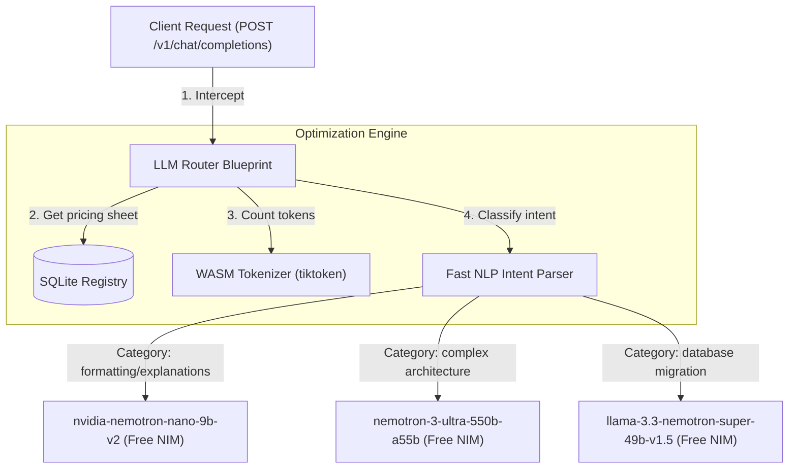
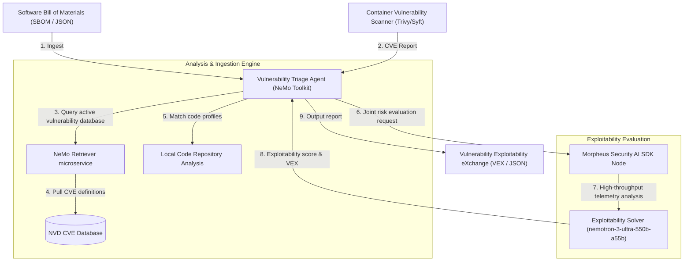

# TokenGateKeeper: Developer & Agent Blueprints Specification (Deep Dive)

This specification details the structural microservices, container deployments, API payloads, and execution pipelines for the NVIDIA Developer and Agent Blueprints.

---

## 1. Nsight Copilot - AI Code Assistant for CUDA Development

### 1.1 Technical Objective
To accelerate CUDA kernel design, memory alignment, and execution profiling. It automates RAG-grounded code synthesis, grounding suggestions in authoritative GPU architecture manuals, memory coalescing constraints, and optimization guides.

### 1.2 System Architecture & Container Topology

```mermaid
graph TD
    IDE["IDE Client (VS Code / Cursor)"] -->|1. Fetch Completion (POST /v1/chat/completions)| Proxy["TokenGateKeeper Interceptor"]
    Proxy -->|2. Route to Blueprint Base URL| Agent["Nsight Copilot Agent Node (FastAPI)"]
    
    subgraph RAG Ingestion & Vector Service
        Agent -->|3. Embed Code (POST /v1/embeddings)| Embed["NeMo Embeddings NIM (nv-embedcode-7b-v1)"]
        Agent -->|4. Query semantic chunk| Retriever["NeMo Retriever microservice"]
        Retriever -->|5. Vector Search| Milvus[("Milvus Vector Store (Index: HNSW)")]
        Milvus -->|6. Return CUDA manuals & books| Retriever
        Retriever -->|7. Return context chunks| Agent
    end
    
    subgraph Inference & Solver
        Agent -->|8. Structured prompt (Context + Query)| Inference["Triton Server (nemotron-3-ultra-550b-a55b)"]
        Inference -->|9. Output streaming tokens| Agent
    end
    
    Agent -->|10. Stream response (text/event-stream)| Proxy
    Proxy -->|11. Expose CUDA autocomplete| IDE
```

### 1.3 Container Specifications & Environment Variables
The blueprint runs as a multi-container Docker Compose stack:
*   **`nsight-copilot-agent`**: Custom FastAPI container handling session state and prompts.
*   **`nemo-retriever-service`**: Handles document extraction and chunking.
*   **`milvus-standalone`**: Vector database storing embedded CUDA manuals.
*   **`triton-inference-server`**: Hosts the Nemotron model locally or connects to NVIDIA NIM hosted API.

```yaml
# Environment variables for execution configuration
SERVICES:
  NVIDIA_API_KEY: "nvapi-..."
  CUDA_VISIBLE_DEVICES: "0,1"
  RETRIEVER_ENDPOINT: "http://localhost:8000/v1/retriever"
  TRITON_SERVER_URL: "http://localhost:8001"
```

### 1.4 Step-by-Step Pipeline Flow
1.  **Request Capture**: The user highlights a CUDA kernel in VS Code and types: *"How do I align shared memory access here?"* The query is dispatched to `/v1/chat/completions`.
2.  **Telemetry Check**: TokenGateKeeper parses the code block, detecting keywords `__shared__` and `threadIdx.x`. It identifies CUDA context and routes to the Nsight Copilot container.
3.  **Embed & Retrieve**: The agent extracts the user query, generates a 4096-dimension embedding via `nv-embedcode-7b-v1`, and queries the Milvus index. It retrieves text blocks explaining: *"CUDA shared memory bank conflicts occur when multiple threads in a warp access the same bank..."*
4.  **Prompt Assembly**: The retrieved context is formatted as a system prompt prefix:
    ```markdown
    [CUDA OPTIMIZATION MANUAL GROUNDING]
    Warp access rules: Shared memory is divided into 32 equal-sized modules called banks.
    Avoid conflicts by mapping thread index variables directly to memory offsets.
    [USER CODE]
    ...
    ```
5.  **Inference**: The query is sent to `nemotron-3-ultra-550b-a55b`. The model utilizes reasoning steps to calculate exact bank index mapping formulas.
6.  **Streaming Return**: The code suggestions stream back to the editor.

### 1.5 API Schema & JSON Payload
*   **Request Endpoint**: `POST http://localhost:8082/v1/copilot/chat`
*   **Request JSON**:
    ```json
    {
      "messages": [
        {
          "role": "user",
          "content": "Optimize: __global__ void add(int *a, int *b) { int id = threadIdx.x; a[id] += b[id]; }"
        }
      ],
      "temperature": 0.2,
      "max_tokens": 1024,
      "cuda_version_target": "12.2"
    }
    ```
*   **Response JSON (Stream Chunk)**:
    ```json
    {
      "choices": [{
        "delta": {
          "content": "To maximize memory throughput, ensure coalesced access..."
        }
      }]
    }
    ```

### System Prerequisites & Minimum Requirements
*   **Hardware Requirements**:
  * NVIDIA DGX Spark
*   **OS Requirements**:
  * Ubuntu 22.04+
*   **Software Requirements**:
  * Docker with Compose v2
  * NVIDIA Container Toolkit

---


## 2. NemoClaw for Hermes Agent

### 2.1 Technical Objective
Autonomous workflow optimization. It observes developer shell executions and IDE chat logs, extracts repetitive loops, synthesizes deterministic Python scripts, and dynamically packages them into the local agent's library of skills.

### 2.2 System Architecture & Container Topology

```mermaid
graph LR
    IDE["IDE / CLI Logger"] -->|1. Audit log| SQLite[(SQLite History Registry)]
    SQLite -->|2. Similarity scans| Scraper["Crystallizer Loop Scanner"]
    
    subgraph NemoClaw Synthesis
        Scraper -->|3. Flag loop pattern| Planner["Hermes Agent Planner (Nemotron 3 Ultra)"]
        Planner -->|4. Generate Python draft| Synth["Script Synthesizer NIM"]
        Synth -->|5. Test run executable| Sandbox["OpenShelf Execution Sandbox"]
        Sandbox -->|6. Verify exit status & schema| TestSuite["Unit Tester Node"]
        TestSuite -->|7. If test passes: Package skill| SkillsLib["Skills Library Directory"]
    end
    
    SkillsLib -->|8. Register MCP Tool| Gateway["TokenGateKeeper MCP Proxy"]
    Gateway -->|9. Hot-mount tool| IDE
```



### 2.3 Container Specifications & Environment Variables
*   **`nemoclaw-hermes-manager`**: The core daemon orchestrating the synthesis cycle.
*   **`openshelf-sandbox`**: Containerized local environment (Python/Bash) running isolated script validation tests.

```yaml
ENV_CONFIG:
  SANDBOX_MEMORY_LIMIT: "512m"
  SKILLS_DIR: "C:/Users/Luis.Blanco/.token_gatekeeper/skills"
  ALLOW_NETWORK_ACCESS: "false"
```

### 2.4 Step-by-Step Pipeline Flow
1.  **Loop Detection**: The local proxy registers that the developer has run the same command string 6 times: *"Filter this JSON log for entries with severity 'ERROR' and calculate latency"*
2.  **Crystallization Proposal**: The Spend Capybara avatar pops up: *"I've identified a repetitive task. Can I crystallize it?"*
3.  **Synthesis Run**: The NemoClaw orchestrator takes the input/output schemas from the history. It requests the code synthesizer model to compile a standalone, deterministic Python script executing the string filtering.
4.  **Sandbox Validation**: The script is written to `/sandbox/temp_run.py`. NemoClaw feeds mock JSON inputs and verifies that the output matches the expected structure.
5.  **MCP Packaging**: Once verified, the script is saved as `~/.token_gatekeeper/skills/log_filter.py`. The Orchestrator registers the tool in TokenGateKeeper's MCP tool schemas.
6.  **Hot Mounting**: The tool is mounted in-memory. The developer's IDE immediately displays the new local tool `log_filter` without restarting the IDE.

### System Prerequisites & Minimum Requirements
*   **Hardware Requirements**:
  * 1x NVIDIA RTX Workstation GPU (24GB VRAM) for local model run or CPU-only with NVIDIA cloud NIM APIs.
*   **OS Requirements**:
  * Ubuntu 22.04+ or Windows 11 with WSL2
*   **Software Requirements**:
  * Docker Engine, NVIDIA Container Toolkit, Python 3.10+, Git

---


## 3. NemoClaw for OpenClaw

### 3.1 Technical Objective
A self-hosted, private agent environment that coordinates file management and execution on local PC hardware, using guardrails to prevent unsafe system actions.

### 3.2 System Architecture & Container Topology



### 3.3 Container Specifications & Environment Variables
*   **`openclaw-core`**: Agent execution core running on localhost.
*   **`nemo-guardrails`**: Input/output moderation node.

### System Prerequisites & Minimum Requirements
*   **Hardware Requirements**:
  * 1x NVIDIA RTX Workstation GPU (24GB VRAM) or CPU-only with NVIDIA cloud NIM APIs.
*   **OS Requirements**:
  * Ubuntu 22.04+ or Windows 11 with WSL2
*   **Software Requirements**:
  * Docker Engine, NVIDIA Container Toolkit, Python 3.10+, Git

---


## 4. LLM Router

### 4.1 Technical Objective
Dynamic request balancing. It parses prompt structures client-side, projects API transaction costs, and routes queries to the cheapest endpoint that matches the execution category.

### 4.2 System Architecture & Container Topology



### 4.3 Classification & Routing Formulas
1.  **Complexity Score ($C_s$) Evaluation**:
    $$C_s = \omega_1 \cdot \text{TokenCount} + \omega_2 \cdot \text{DepthKeywords} + \omega_3 \cdot \text{ASTComplexity}$$
    Where:
    *   $\omega_1 = 0.4$, $\omega_2 = 0.4$, $\omega_3 = 0.2$.
    *   `DepthKeywords` flags abstract planning terms (`architecture`, `database schema`, `race condition`).
2.  **Routing Threshold**:
    *   If $C_s < 3.0 \rightarrow$ Route to `nvidia-nemotron-nano-9b-v2` (Cost: $\$0.00$)
    *   If $3.0 \le C_s < 7.0 \rightarrow$ Route to `llama-3.3-nemotron-super-49b-v1.5` (Cost: $\$0.00$)
    *   If $C_s \ge 7.0 \rightarrow$ Route to `nemotron-3-ultra-550b-a55b` (Cost: $\$0.00$)

### System Prerequisites & Minimum Requirements
*   **Hardware Requirements**:
  * Any NVIDIA GPU with an architecture newer than Volta™ (V100), such as Turing™ (T4), Ampere™ (A100, RTX 30 series), Hopper™ (H100), or later.
  * Minimum 16GB GPU memory for Qwen 1.7B model serving
  * Additional 8GB GPU memory if using neural network routing with CLIP
*   **Software Requirements**:
  * Linux operating systems (Ubuntu 22.04 or later recommended) or macOS
  * Git LFS
  * Docker
  * Docker Compose
  * NVIDIA API key from build.nvidia.com (see instructions)
  * Python 3.12+ and uv package manager (for local development)
  * Azure OpenAI API access or standard OpenAI API key for GPT-5 Chat model

---


## 5. Vulnerability Analysis for Container Security

### 5.1 Technical Objective
To automate the evaluation and triage of Common Vulnerabilities and Exposures (CVEs) within containerized application environments. It parses Software Bills of Materials (SBOMs), cross-references them against active vulnerability databases, and runs reasoning models to evaluate the true exploitability of code signatures under current system profiles.

### 5.2 System Architecture & Container Topology



### 5.3 Container Specifications & Environment Variables
*   **`vulnerability-triage-agent`**: FastAPI framework integrating NeMo Toolkit and prompt planners.
*   **`morpheus-security-node`**: GPU-accelerated pipeline processor for cybersecurity logs and SBOM tokens.
*   **`nemo-retriever-service`**: Connects agent RAG pipelines to CVE definitions.

```yaml
SERVICES:
  NVIDIA_API_KEY: "nvapi-..."
  NVD_DATA_PATH: "/data/nvd"
  EXPLOITABILITY_THRESHOLD: "0.75"
  MORPHEUS_GPU_CORES: "all"
```

### 5.4 Step-by-Step Pipeline Flow
1.  **Vulnerability Scanning**: A standard DevSecOps scanner (e.g. Syft/Trivy) parses the container image and outputs an SBOM containing package versions and associated CVE IDs.
2.  **Telemetry Routing**: The triage agent receives the SBOM and CVE list. It triggers the retrieval pipeline to pull vulnerability signatures and public exploits associated with those IDs.
3.  **Dependency Alignment**: The agent performs a static AST analysis on the target repository to verify whether the vulnerable functions within the libraries are actually imported and executed in the source code.
4.  **Security Filtering**: The Morpheus SDK filters logs to check if the network ports related to the vulnerability vectors are open in deployment configurations.
5.  **Exploitability Triage**: The consolidated data is structured as a prompt and evaluated by `nemotron-3-ultra-550b-a55b`. The model determines if the threat is a false positive based on import paths and environment settings.
6.  **VEX Summary Generation**: The agent writes a JSON-formatted VEX document marking the exploitability status (e.g. `not_affected`, `affected`) and recommended patch targets.

### 5.5 API Schema & JSON Payload
*   **Request Endpoint**: `POST http://localhost:8084/v1/security/triage`
*   **Request JSON**:
    ```json
    {
      "sbom_path": "/data/reports/app_sbom.json",
      "cve_list": ["CVE-2024-12345", "CVE-2024-67890"],
      "environment": "production",
      "allow_nvd_fetch": true
    }
    ```
*   **Response JSON (VEX Payload)**:
    ```json
    {
      "triage_summary": {
        "cve_id": "CVE-2024-12345",
        "status": "not_affected",
        "justification": "vulnerable_code_not_imported",
        "details": "The library is installed but the vulnerable function 'validate_session' is never imported or executed in the active application source code.",
        "remediation": "No immediate patch required. Upgrade to library v2.1.4 on next release cycle."
      }
    }
    ```

### System Prerequisites & Minimum Requirements
*   **General**:
  * Hardware Requirements
  * The vulnerability analysis workflow supports the following hardware (only required if self-hosting NIMs):
  * (Optional) LLM NIM: Meta Llama 3.1 70B Instruct Support Matrix
  * This workflow makes heavy use of parallel LLM calls to accelerate processing. For improved parallel performance (for example, in production workloads), we recommend 8x or more H100s for LLM inference.
  * (Optional) Embedding NIM: NV-EmbedQA-E5-v5 Support Matrix
  * OS Requirements
  * Ubuntu 20.04/22.04
  * Inference
  * LLM NIM: NIM of meta/llama-3.1-70b-instruct
  * Embedding NIM: NIM of nvidia/nv-embedqa-e5-v5
  * Example Container and CVEs
  * Containers:
  * morpheus: NVIDIA Cybersecurity SDK
  * Vulnerability Alerts:
  * GHSA-3f63-hfp8-52jq: Arbitrary Code Execution in Pillow
  * 
  * CVE-2024-21762: Fortinet FortiOS SSL VPN out-of-bounds write allows remote code execution
  * 
  * CVE-2022-47695: Binutils objdump denial of service via malformed Mach-O files
