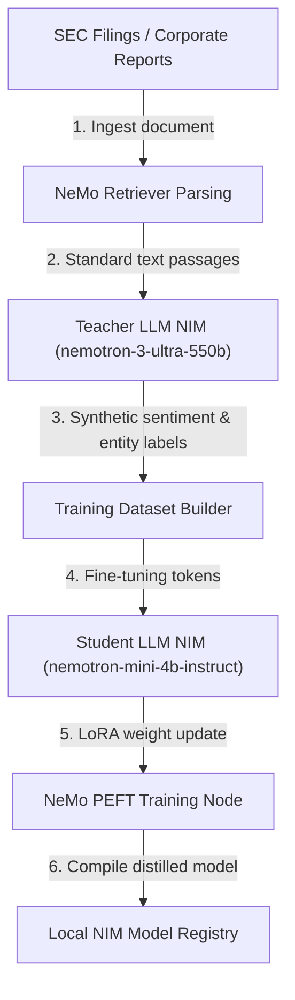
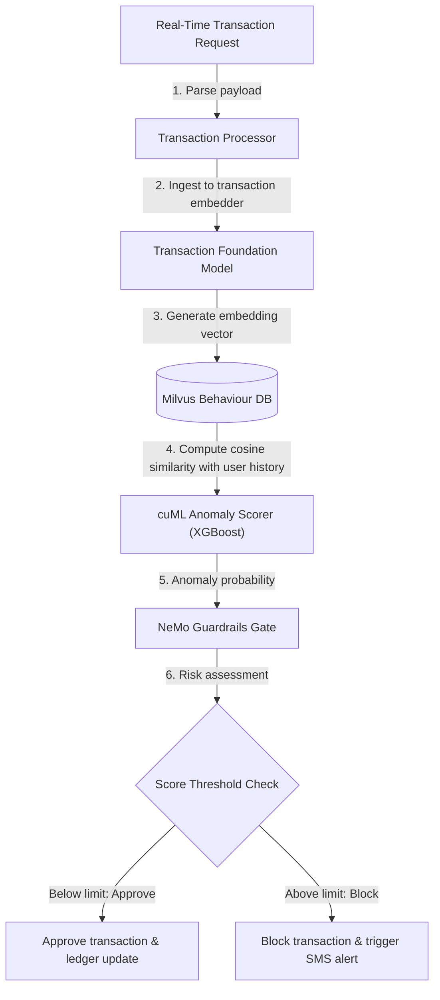
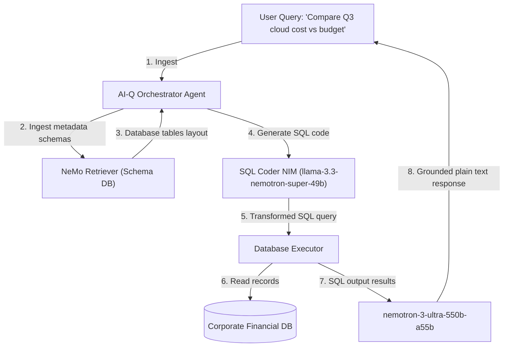

# TokenGateKeeper: Financial Services Blueprints Specification (Deep Dive)

This specification details the mathematical models, container topologies, data processing streams, and integration interfaces for NVIDIA Financial Services Blueprints.

---

## 1. Quantitative Signal Discovery Agent

### 1.1 Technical Objective
Automates the discovery, extraction, and validation of statistical arbitrage and trading signals (alpha generation) from massive tick database files. It generates executable Python backtesting code, validating performance in parallel GPU simulations.

### 1.2 System Architecture & Container Topology

```mermaid
graph TD
    Market[("Market Data Store (Parquet/CSV)")] -->|1. Bulk read| cuDF["cuDF Data Science Node (GPU)"]
    cuDF -->|2. Preprocessed returns| Generator["Signal Formula Generator (Nemotron 3 Ultra)"]
    Generator -->|3. Synthesized Python code| Backtester["HPC Simulator Container (cuDF + cuPy)"]
    Backtester -->|4. Performance metrics (Sharpe, drawdown)| Evaluator["Signal Evaluator Node"]
    Evaluator -->|5. Refusal / Adjust prompts| Generator
    Evaluator -->|6. Approved signal| Registry[("Alpha Database Ledger")]
```

### 1.3 Container Specifications & Environment Variables
*   **`cudf-preprocessing-gpu`**: Raw parquet processing container utilizing RAPIDS.
*   **`alpha-generator-node`**: Orchestration LLM container executing formula synthesis.
*   **`hpc-backtest-simulator`**: Runs vectorized simulation on CUDA cores.

```yaml
ENVIRONMENT:
  CUDA_VISIBLE_DEVICES: "0,1"
  TICK_DATA_PATH: "/data/parquet/ticks"
  SHARPE_THRESHOLD: "2.0"
  MAX_BACKTEST_GENS: "50"
```

### 1.4 Step-by-Step Pipeline Flow
1.  **Data Preprocessing**: The `cudf-preprocessing-gpu` container reads raw CSV/Parquet tick data and calculates joint distribution returns and volume offsets on the GPU.
2.  **Prompt Formulation**: Summary statistics and target parameters (e.g. asset class, drawdown limit) are fed to the `alpha-generator-node`.
3.  **Signal Generation**: `nemotron-3-ultra-550b-a55b` generates a mathematical formula (e.g., `decay_linear(ts_rank(volume, 5), 10)`) and compiles it into an executable Python backtest script.
4.  **Vectorized Backtesting**: The `hpc-backtest-simulator` runs the generated backtest script over historical arrays using cuPy and cuDF, returning performance parameters (Sharpe, Sortino, max drawdown).
5.  **Triage and Logging**: The evaluator verifies the performance metrics. If the Sharpe ratio is above 2.0 and max drawdown is within limits, the formula is saved to the alpha database ledger. Otherwise, optimization logs are fed back to the generator for parameter tuning.

### 1.5 API Schema & JSON Payload
*   **Endpoint**: `POST http://localhost:8083/v1/alpha/discover`
*   **Request JSON**:
    ```json
    {
      "assets": ["AAPL", "MSFT", "NVDA"],
      "start_date": "2024-01-01",
      "end_date": "2025-12-31",
      "target_metric": "Sharpe",
      "max_drawdown_limit": 0.15
    }
    ```
*   **Response JSON (Signal Registry Entry)**:
    ```json
    {
      "signal_id": "alpha_sharpe_2_41",
      "formula": "decay_linear(ts_rank(volume, 5), 10)",
      "sharpe_ratio": 2.41,
      "max_drawdown": 0.082,
      "code_path": "/data/backtests/alpha_sharpe_2_41.py"
    }
    ```

### System Prerequisites & Minimum Requirements
*   **Hardware Requirements**:
  * GPU: 1x NVIDIA GPU with 48GB+ VRAM (e.g., A100 80GB, H100) for local NIM deployment
  * RAM: 16 GB
  * Storage: 5 GB free disk space (for S&P 500 data and model outputs)
  * Note: If using the hosted NIM API at build.nvidia.com, no local GPU is required. The workflow runs CPU-only and calls the NIM inference endpoint remotely. Additionally, a Milvus vector database instance is required for product catalog embeddings, and Arize Phoenix is recommended for distributed tracing and observability across the multi-agent workflow.
*   **OS**:
  * Linux (Ubuntu 22.04+), macOS, or Windows
*   **Deployment Options**:
  * Python virtual environment (pip or uv)
  * Jupyter Notebook

---


## 2. Build Your Own Transaction Foundation Model

### 2.1 Technical Objective
To train a transformer-based foundation model on tabular customer ledger registers, generating high-quality transaction and client embeddings that capture customer spending behavior.

### 2.2 System Architecture & Container Topology

```mermaid
graph TD
    Ledger[("Raw Transaction Ledger Database")] -->|1. Batch extract| Preprocessor["cuDF Processing Engine"]
    Preprocessor -->|2. Map fields (merchant, amount, delta-t) to tokens| Tokenizer["Tabular Transaction Tokenizer"]
    Tokenizer -->|3. Sequence input profiles| Model["Tabular Transformer (BERT-style)"]
    Model -->|4. MLM pre-training loss| Training["NeMo Pre-Training Daemon"]
    Model -->|5. Multi-task fine-tuning (fraud, risk)| Tuning["NeMo Fine-Tuning Node"]
    Tuning -->|6. Transaction / User embeddings| EmbeddingsDB[("Transaction Embeddings Database")]
```

### 2.3 Container Specifications & Environment Variables
*   **`cudf-data-ingest`**: Standard data preprocessing worker converting raw banking database tables.
*   **`nemo-pretrain-runner`**: Runs massive pre-training tasks using multi-GPU instances.
*   **`embeddings-milvus`**: High-availability vector database index.

```yaml
SERVICES:
  NEO_BATCH_SIZE: "4096"
  TABULAR_EMBEDDING_DIM: "768"
  MILVUS_INDEX_TYPE: "IVF_FLAT"
```

### 2.4 Step-by-Step Pipeline Flow
1.  **Ingestion & Structuring**: Raw transaction tables ( merchant, timestamp, amount, location ) are read from ledgers.
2.  **GPU Normalization**: `cuDF` aligns transaction strings, maps discrete categories to index values, and calculates the delta-time between consecutive transactions on GPU.
3.  **Tokenization**: The tokenizer maps the tabular fields into a joint representation vector, structuring consecutive user transactions as a sequence of tokens.
4.  **BERT Masked Pre-Training**: The NeMo pretrain runner trains a tabular transformer via Masked Language Modeling (MLM), learning to predict missing attributes in transactions.
5.  **Multi-Task Fine-Tuning**: The model is fine-tuned to extract sequential representations. The resulting embeddings are saved directly to the Milvus Vector Database for downstream fraud classification or risk underwriting tasks.

### 2.5 API Schema & JSON Payload
*   **Endpoint**: `POST http://localhost:8083/v1/transactions/embed`
*   **Request JSON**:
    ```json
    {
      "customer_id": "cust_987654",
      "transactions": [
        {
          "merchant_id": "mch_walmart_302",
          "amount": 42.50,
          "timestamp": "2026-06-12T14:30:00Z"
        },
        {
          "merchant_id": "mch_starbucks_102",
          "amount": 5.75,
          "timestamp": "2026-06-12T16:15:00Z"
        }
      ]
    }
    ```
*   **Response JSON**:
    ```json
    {
      "customer_id": "cust_987654",
      "embedding_vector": [0.0124, -0.0543, 0.1287, 0.9412, -0.3211],
      "dimension": 768
    }
    ```

### System Prerequisites & Minimum Requirements
*   **General**:
  * Hardware Requirements
  * GPU: 1x NVIDIA A100 (80GB) or H100
  * RAM: 32 GB
  * OS: Ubuntu 22.04
  * Deployment Options
  * Docker

---


## 3. AI Model Distillation for Financial Data

### 3.1 Technical Objective
To distill massive, general-purpose LLMs into small, low-latency, domain-specific models for financial classification (e.g. sentiment score calculation, SEC filing entity extraction).

### 3.2 System Architecture & Container Topology



### 3.3 Container Specifications & Environment Variables
*   **`nemoretriever-parser`**: OCR and layout-aware parser extracting text blocks.
*   **`teacher-nim-550b`**: Hosts the Nemotron 3 Ultra teacher model on cloud endpoints.
*   **`nemo-peft-tuning`**: Runs parameter-efficient fine-tuning on local GPUs.

```yaml
DISTILLATION:
  PEFT_METHOD: "LoRA"
  LORA_R: "16"
  LORA_ALPHA: "32"
  STUDENT_BASE_MODEL: "nvidia/nemotron-mini-4b-instruct"
```

### 3.4 Step-by-Step Pipeline Flow
1.  **Ingestion & Parsing**: SEC filing PDFs are processed by NeMo Retriever to extract clean textual passages and remove formatting noise.
2.  **Teacher Labeling**: The textual extracts are routed to `nemotron-3-ultra-550b-a55b` (Teacher) to generate synthetic labels and detailed reasoning traces.
3.  **Dataset Construction**: The text inputs and Teacher-generated labels are compiled into a fine-tuning dataset formatted for the Student model.
4.  **PEFT Training**: The `nemo-peft-tuning` node trains `nemotron-mini-4b-instruct` (Student) on the compiled dataset using LoRA configurations, minimizing the KL divergence between student and teacher distributions.
5.  **NIM Compilation**: The fine-tuned weights are compiled into a lightweight NIM model and registered in the local TokenGateKeeper catalog, ready for low-latency inference.

### 3.5 API Schema & JSON Payload
*   **Endpoint**: `POST http://localhost:8083/v1/distill/train`
*   **Request JSON**:
    ```json
    {
      "teacher_model": "nvidia/nemotron-3-ultra-550b-a55b",
      "student_model": "nvidia/nemotron-mini-4b-instruct",
      "dataset_path": "/data/sec_filings_labeled.json",
      "epochs": 3,
      "learning_rate": 2e-4
    }
    ```
*   **Response JSON**:
    ```json
    {
      "status": "completed",
      "output_model_id": "distilled-finance-nemotron-4b-v1",
      "accuracy_vs_teacher": 0.942,
      "avg_latency_ms": 14.5
    }
    ```

### System Prerequisites & Minimum Requirements
*   **Hardware Requirements**:
  * 2x (NVIDIA A100/H100/H200/B200 GPUs)
  * Minimum Memory: 1GB (512MB reserved for Elasticsearch)
  * Storage: Varies based on log volume and model size (at least 200GB to run the Blueprint)
  * Network: Ports 8000 (API), 9200 (Elasticsearch), 27017 (MongoDB), 6379 (Redis), 5000 (MLFlow)
*   **OS Requirements**:
  * Ubuntu 22.04 OS
*   **Software Dependencies**:
  * Elasticsearch 8.12.2
  * MongoDB 7.0
  * Redis 7.2
  * FastAPI (API server)
  * Celery (task processing)
  * Python 3.12
  * MLflow 2.22.0
  * Wandb 0.22.3
  * One of the following orchestration tools:
  * Docker Engine & Docker Compose (for local development and simple, single-host environments)
  * Kubernetes (>=1.25) and Helm (>=3.8) (for production and multi-node clusters)

---


## 4. Quantitative Portfolio Optimization

### 4.1 Technical Objective
To solve large-scale Mean-Conditional Value-at-Risk (Mean-CVaR) portfolio optimization models in real-time, handling thousands of asset classes under complex concentration rules.

### 4.2 System Architecture & Container Topology

```mermaid
graph TD
    Returns[("Historical Returns Matrix")] -->|1. Load scenarios| cuML["cuML KDE Scenario Simulator"]
    cuML -->|2. Generate 100k return scenarios| ScenarioDB[("Scenario Matrix Store")]
    ScenarioDB -->|3. Build linear constraint matrices| Generator["Optim-Matrix Generator"]
    Generator -->|4. Dispatched linear program| cuOpt["cuOpt Linear Program Solver"]
    cuOpt -->|5. GPU-accelerated PDHG execution| Solver["Optimization Core"]
    Solver -->|6. Optimal asset weights vector (w)| Allocator["Portfolio Allocator Agent"]
```

### 4.3 Solver Configuration & Execution Flow
1.  **Scenario Simulation**: The historical return variables are loaded. `cuML` generates a matrix of 100,000 future return scenarios using Kernel Density Estimation (KDE).
2.  **Optimization Formulation**: The scenarios are formatted into linear inequality constraint matrices to optimize:
    $$\min_{w} \quad \text{CVaR}_{\alpha}(w) - \lambda \cdot \mu^T w$$
    subject to concentration and budget bounds:
    $$e^T w = 1, \quad w \ge 0$$
3.  **Solver Dispatch**: The optimizer formats the coefficients and dispatches the linear program to the `cuOpt Linear Program Solver`.
4.  **Parallel Execution**: cuOpt runs the Primal-Dual Hybrid Gradient (PDHG) algorithm across thousands of GPU threads, solving the allocation variables in milliseconds.
5.  **Asset Allocation**: The optimizer outputs the weight allocations vector $w$ back to the asset ledger database.

### 4.4 API Schema & JSON Payload
*   **Endpoint**: `POST http://localhost:8083/v1/portfolio/optimize`
*   **Request JSON**:
    ```json
    {
      "assets": ["AAPL", "MSFT", "NVDA", "AMZN"],
      "risk_tolerance_lambda": 0.5,
      "confidence_level_alpha": 0.95,
      "max_asset_weight": 0.35
    }
    ```
*   **Response JSON**:
    ```json
    {
      "optimal_weights": {
        "AAPL": 0.25,
        "MSFT": 0.35,
        "NVDA": 0.30,
        "AMZN": 0.10
      },
      "expected_return": 0.185,
      "computed_cvar": 0.042,
      "solver_time_ms": 34.2
    }
    ```

### System Prerequisites & Minimum Requirements
*   **Hardware Requirements**:
  * NVIDIA H100 SXM (compute capability >= 9.0) and above
  * CPU: 32+ cores
  * NVMe SSD Storage: 100+ GB free space
  * OS requirements
  * Linux distributions with glibc>=2.28 (released in August 2018):
  * Arch Linux (minimum version 2018-08-02)
  * Debian (minimum version 10.0)
  * Fedora (minimum version 29)
  * Linux Mint (minimum version 20)
  * Rocky Linux / Alma Linux / RHEL (minimum version 8)
*   **Software Requirements**:
  * cuopt-cu13==25.10.0
  * cuml-cu13==25.10.0
*   **3rd Party Technologies**:
  * numpy
  * pandas
  * cvxpy
  * scipy
  * scikit-learn
  * seaborn

---


## 5. Financial Fraud Detection

### 5.1 Technical Objective
A real-time anomaly detection scoring node evaluating card transaction records against transaction embeddings databases.

### 5.2 System Architecture & Container Topology



### 5.3 Container Specifications & Environment Variables
*   **`transaction-embedder`**: Encodes raw fields to embeddings vectors.
*   **`milvus-beh-db`**: Vector database index query engine.
*   **`cuml-anomaly-scorer`**: GPU-accelerated XGBoost decision tree execution node.
*   **`nemo-guardrails-node`**: Enforces compliance checks.

```yaml
FRAUD_CHECK:
  MILVUS_URI: "http://milvus-standalone:19530"
  CLASSIFIER_PATH: "/models/xgboost_fraud.bin"
  RISK_THRESHOLD: "0.85"
```

### 5.4 Step-by-Step Pipeline Flow
1.  **Transaction Capture**: An incoming swipe or checkout request is parsed by the transaction processor.
2.  **Feature Encoding**: The transaction values are encoded into a vector representation using the transaction foundation model.
3.  **Behavior Matching**: The Milvus database queries the client's past transaction embeddings, computing historical similarity.
4.  **Classification**: The new transaction embedding, along with similarity metrics and metadata, is evaluated by the `cuml-anomaly-scorer` (XGBoost classifier running on GPU).
5.  **Guardrail Assessment**: NeMo Guardrails checks the risk score against regulatory override settings.
6.  **Resolution**: If the risk score exceeds 0.85, the transaction is declined and flagged for review. Otherwise, it is approved.

### 5.5 API Schema & JSON Payload
*   **Endpoint**: `POST http://localhost:8083/v1/fraud/assess`
*   **Request JSON**:
    ```json
    {
      "transaction_id": "tx_abc1234",
      "card_number_hash": "2a9f4c3d...",
      "amount": 1250.00,
      "merchant_category_code": "5732",
      "ip_country": "CN",
      "card_present": false
    }
    ```
*   **Response JSON**:
    ```json
    {
      "transaction_id": "tx_abc1234",
      "status": "declined",
      "risk_probability": 0.942,
      "reason": "suspicious_amount_location_combination",
      "remediation": "SMS verification sent to cardholder."
    }
    ```

### System Prerequisites & Minimum Requirements
*   **Hardware Requirements**:
  * GPU: 1x A6000, A100, or H100, minimum of 32 GB of memory
  * CPU: x86_64 architecture
  * Storage: 10 GB
  * System Memory: 16 GB
*   **Software Requirements**:
  * Operating System: Ubuntu 20.04 or newer
  * NVIDIA Driver version: 535 or newer
  * NVIDIA CUDA version: 12.4 or newer
  * NVIDIA Container Toolkit version: 1.15.0 or newer
  * Docker version: Docker version 26 or newer

---


## 6. NVIDIA AI-Q Blueprint for Intelligent Agents

### 6.1 Technical Objective
To deploy a corporate RAG gateway capable of securely querying internal financial databases, database tables, and policy registries.

### 6.2 System Architecture & Container Topology



### 6.3 Step-by-Step Data Retrieval Pipeline
1.  **Query Capture**: The user submits a question: *"Compare Q3 cloud cost vs budget."*
2.  **Schema Retrieval**: The orchestrator queries `NeMo Retriever` to pull the SQL table layouts and schema configurations matching "cloud cost" and "budget".
3.  **SQL Translation**: The orchestrator sends the schemas and user query to `llama-3.3-nemotron-super-49b`, which compiles a structured SQL query:
    `SELECT SUM(cost) FROM cloud_bills WHERE quarter='Q3'`.
4.  **Local Execution**: The database executor runs the SQL query against the corporate financial database, returning the raw records.
5.  **Output Grounding**: The raw data records are sent to `nemotron-3-ultra-550b-a55b` alongside the user query. The model writes a plain-text response, grounding the figures in the actual database output to prevent hallucination.

### 6.4 API Schema & JSON Payload
*   **Endpoint**: `POST http://localhost:8083/v1/aiq/query`
*   **Request JSON**:
    ```json
    {
      "query": "What was the total marketing spend in 2025?",
      "database_target": "corporate_ledgers",
      "strict_grounding": true
    }
    ```
*   **Response JSON**:
    ```json
    {
      "answer": "The total marketing spend in 2025 was $4,215,800.",
      "generated_sql": "SELECT SUM(amount) FROM ledger WHERE department='Marketing' AND year=2025",
      "sources": ["table: ledger", "rows_matched: 12"],
      "confidence_score": 0.99
    }
    ```

### System Prerequisites & Minimum Requirements
*   **General**:
  * Users may have to wait 5–10 minutes for the instance to start, depending on cloud availability.
*   **Disk Space**:
  * 435 GB minimum
*   **OS Requirements**:
  * Ubuntu 22.04 OS
*   **Deploy Options**:
  * Docker Compose
*   **Drivers**:
  * NVIDIA Container ToolKit
  * GPU Driver - 530.30.02 or later
  * CUDA version - 12.6 or later
*   **Hardware Requirements**:
  * The biomedical research agent blueprint supports the following hardware and system configurations:
*   **For running all services locally**:
  * Use	Service(s)	Recommended GPU*
  * Nemo Retriever Microservices for multi-modal document ingest	graphic-elements, table-structure, paddle-ocr, nv-ingest, embedqa	1 x H100 80GB*
  * 1 x A100 80GB
  * Reasoning Model for Report Generation and RAG Q&A Retrieval	llama-3.3-nemotron-super-49b-v1 with a FP8 profile	1 x H100 80 GB*
  * 2 x A100 80GB
  * Instruct Model for Report Generation	llama-3.3-70b-instruct	2 x H100 80GB*
  * 4 x A100 80GB
  * Generative Model for Small Molecule Drug Development	nvcr.io/nim/nvidia/molmim:1.0.0	Single Ampere/L40 GPU with at least 3 GB memory
  * (doc)
  * Generative Model for Molecular Docking	nvcr.io/nim/mit/diffdock:2.1.0	1 x H100 80GB
  * 1 x A100 40GB
  * 1 x A6000 48GB
  * 1 x A10 24GB
  * 1 x L40S 48GB
  * (doc)
  * Total	Entire Biomedical AIQ Research Agent	5 x H100 80GB*
  * 8 x A100 80GB
*   **For running with hosted NVIDIA NIM Microservices**:
  * This blueprint can be run entirely with hosted NVIDIA NIM Microservices, see https://build.nvidia.com/ for details.
