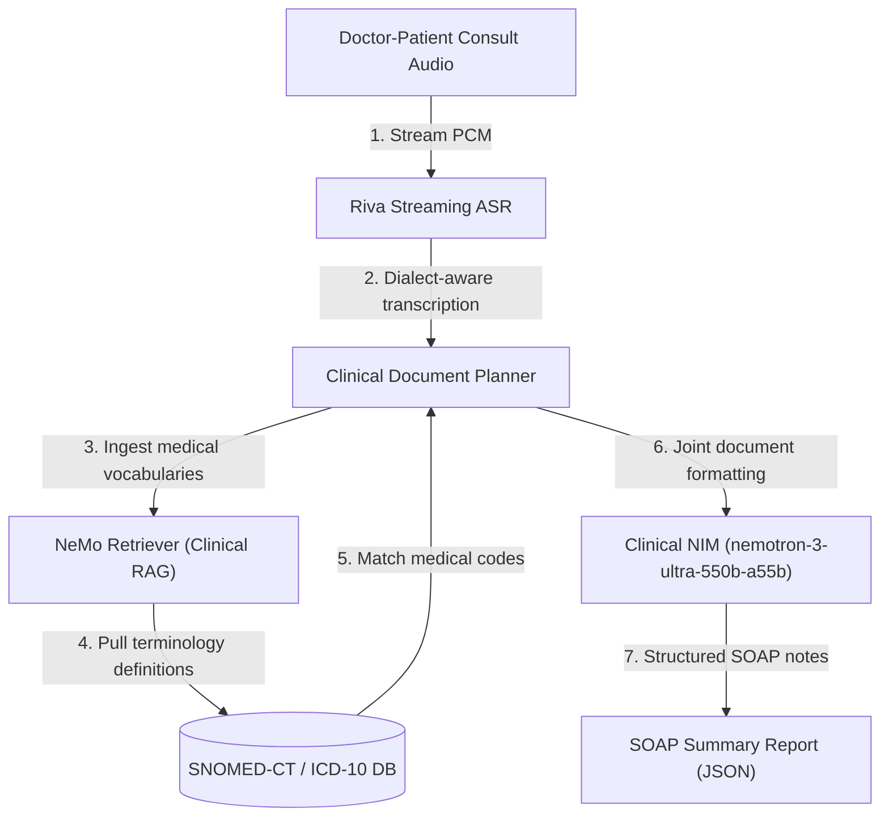
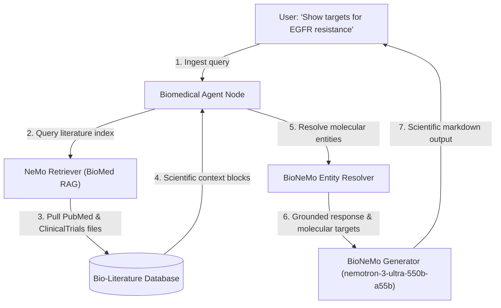
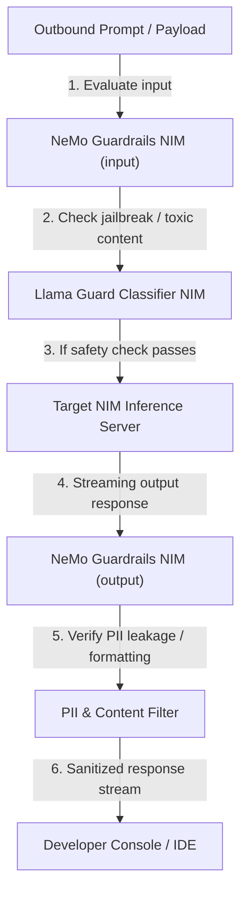
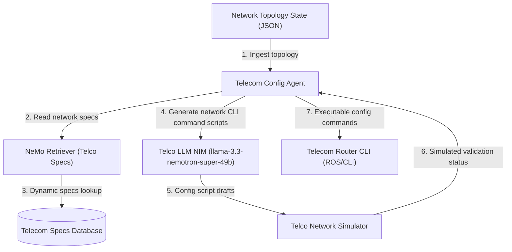
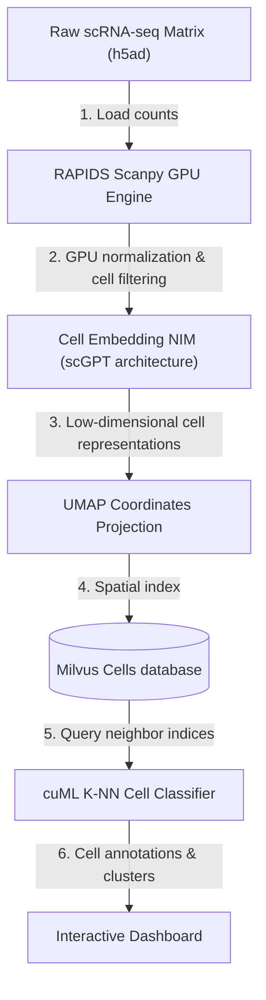
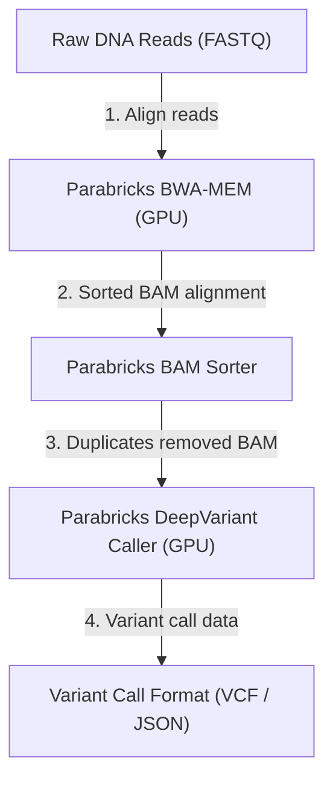
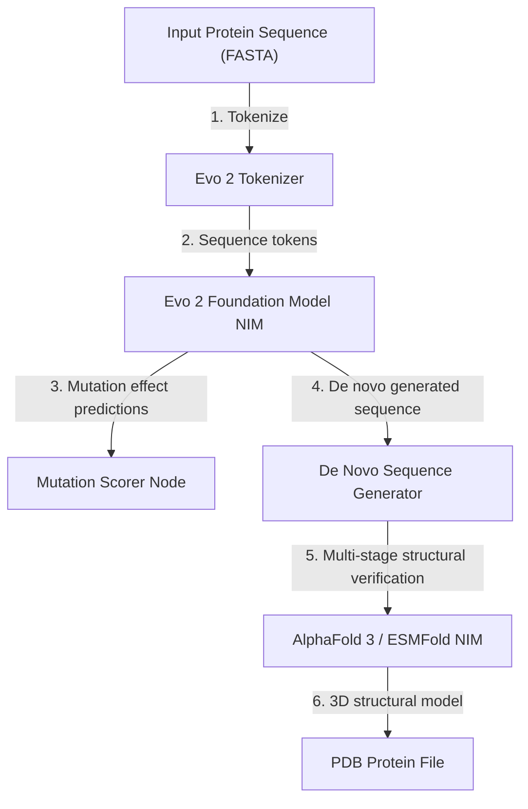
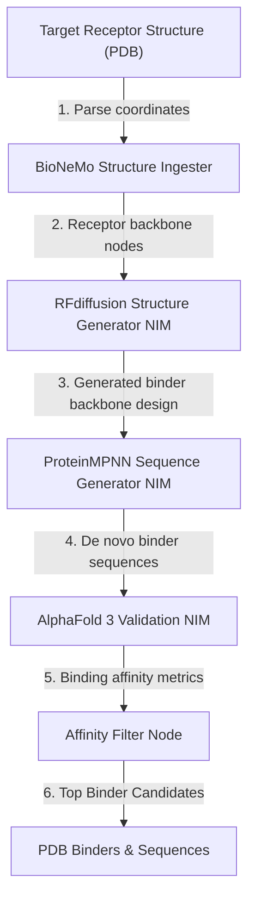
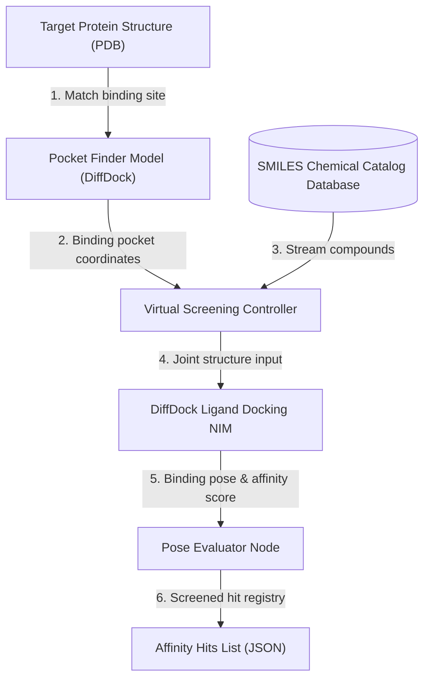

# TokenGateKeeper: Healthcare & Science Blueprints Specification (Deep Dive)

This document details the container layouts, biological workflows, alignment scripts, and API schemas for NVIDIA Healthcare & Life Sciences Blueprints, including the Telecom blueprint.

---

## 1. Ambient Healthcare Agents

### 1.1 Technical Objective
Automates clinical documentation from Doctor-Patient consultation recordings. It transcribes audio streams, extracts medical entities, maps them to reference taxonomies (SNOMED-CT / ICD-10), and compiles structured SOAP (Subjective, Objective, Assessment, Plan) records.

### 1.2 System Architecture & Container Topology



### 1.3 Container Specifications & Environment Variables
*   **`riva-medical-asr`**: Riva container fine-tuned on healthcare terminology and pharmacopoeias.
*   **`nemo-retriever-clinical`**: RAG service linked to local medical dictionaries.
*   **`clinical-summarization-nim`**: Model executing clinical documentation templates.

```yaml
HEALTHCARE:
  ASR_MODEL: "riva-asr-medical-english"
  DICTIONARY_PATH: "/data/snomed_ct_2026.db"
  OUTPUT_FORMAT: "SOAP_JSON"
```

### 1.4 Step-by-Step Pipeline Flow
1.  **Audio Ingestion**: Audio from the clinic microphone streams into `riva-medical-asr` as binary chunks.
2.  **Transcription**: The audio is converted to text, flagging potential clinical keywords.
3.  **Vocabulary Resolution**: The clinical planner queries NeMo Retriever to translate symptoms (e.g. *"heart pounding"*) to medical terms (e.g. *SNOMED-CT: 8043003 - Palpitations*).
4.  **SOAP Compilation**: The text and matched codes are compiled by `nemotron-3-ultra-550b-a55b` into a structured SOAP clinical note.
5.  **Record Logging**: The output SOAP report is saved to the Electronic Health Record (EHR) database.

### 1.5 API Schema & JSON Payload
*   **Endpoint**: `POST http://localhost:8087/v1/healthcare/soap`
*   **Request JSON**:
    ```json
    {
      "consultation_id": "consult_2026_09",
      "audio_file_path": "/data/recordings/consult_2026_09.wav",
      "specialty": "cardiology"
    }
    ```
*   **Response JSON (SOAP Note)**:
    ```json
    {
      "clinical_notes": {
        "subjective": "Patient reports palpitations occurring after exercise...",
        "objective": "BP: 120/80 mmHg, HR: 72 bpm, regular rhythm...",
        "assessment": "SNOMED-CT: 8043003 (Palpitations), ICD-10: R00.2",
        "plan": "Schedule 24-hour Holter monitoring. Follow up in two weeks."
      }
    }
    ```

### System Prerequisites & Minimum Requirements
*   **General**:
  * Note: Users may have to wait 5–10 minutes for the instance to start, depending on cloud availability.
*   **Operating System & System Software**:
  * Ubuntu 22.04
  * Docker Version 28.1+ with Docker Compose plugin
*   **Storage**:
  * Ambient Patient Agent: 302 GB (for self-hosted configuration)
  * Ambient Provider Agent: 325 GB (for self-hosted configuration)
*   **Hardware Requirements**:
  * The ambient healthcare agents developer example supports the following hardware and system configurations:
*   **Ambient Provider Agent**:
  * Self-Hosted Configuration:
  * Service	Use Case	Recommended GPU
  * Riva ASR NIM	Audio Transcription and Diarization	1x various options including
  * L40, A100, and more (see modelcard)
  * Reasoning Model	Medical Note (SOAP) Generation	2x H100 80 GB
  * or 4x A100 80 GB
  * NVIDIA API Catalog Configuration:
  * No GPU requirement when using public NVIDIA endpoints for NIM microservices (build.nvidia.com)
*   **Ambient Patient Agent**:
  * Self-Hosted Configuration:
  * Service	Use Case	Recommended GPU
  * Riva ASR NIM	Audio Transcription	1x various options including L40,
  * A100, and more (see modelcard)
  * Riva TTS NIM	Speech Synthesis	1x various options including L40,
  * A100, and more (see modelcard)
  * NemoGuard Content Safety Model
  * (Optional for enabling NeMo Guardrails)	Content Safety	1x options including A100, H100,
  * L40S, A6000 (see modelcard)
  * NemoGuard Topic Control Model
  * (Optional for enabling NeMo Guardrails)	Topic Control	1x options including A100, H100,
  * L40S, A6000 (see modelcard)
  * Instruct Model	Agent Reasoning
  * and Tool Calling	2x H100 80 GB
  * or 4x A100 80GB (see modelcard)
  * NVIDIA API Catalog Configuration:
  * No GPU requirement when using public NVIDIA endpoints for NIM microservices (build.nvidia.com)

---


## 2. Biomedical AI-Q Research Agent Blueprint

### 2.1 Technical Objective
Ingests clinical literature, abstracts, and trials data, generating grounded summaries and target molecular hypotheses using specialized biomedical models.

### 2.2 System Architecture & Container Topology



### 2.3 Container Specifications & Environment Variables
*   **`biomedical-agent-node`**: Manages research queries and coordinates translation tasks.
*   **`nemo-retriever-biomed`**: Search index for PubMed, PMC, and clinical trials databases.
*   **`bionemo-entity-resolver`**: Maps mentions in text to standard gene and protein IDs.

```yaml
BIOMED:
  INDEX_SOURCE: "pubmed_abstracts_active"
  GROUNDING_STRICTNESS: "0.9"
```

### 2.4 Step-by-Step Pipeline Flow
1.  **Request Capture**: A researcher queries: *"Show targets for EGFR resistance."*
2.  **RAG Fetch**: NeMo Retriever queries PubMed and ClinicalTrials indexes for relevant documentation.
3.  **Entity Resolution**: BioNeMo extracts protein names, small molecules, and cell lines from the text.
4.  **Hypothesis Generation**: `nemotron-3-ultra-550b-a55b` evaluates the retrieved context to summarize mutations and generate potential drug targets.
5.  **Output Display**: The scientific summary is returned with clear database citations.

### 2.5 API Schema & JSON Payload
*   **Endpoint**: `POST http://localhost:8087/v1/biomedical/query`
*   **Request JSON**:
    ```json
    {
      "query": "Identify current pathways targeted in metastatic melanoma trials.",
      "include_clinical_trials": true,
      "max_citations": 5
    }
    ```
*   **Response JSON**:
    ```json
    {
      "summary": "Metastatic melanoma trials primarily target the MAPK pathway...",
      "pathways": ["MAPK", "PI3K/Akt"],
      "citations": [
        {"source": "PubMed", "id": "PMID3829124"}
      ]
    }
    ```

### System Prerequisites & Minimum Requirements
*   **General**:
  * Users may have to wait 5–10 minutes for the instance to start, depending on cloud availability.
*   **Disk Space**:
  * 435 GB minimum
*   **OS Requirements**:
  * Ubuntu 22.04 OS
*   **Deploy Options**:
  * Docker Compose
*   **Drivers**:
  * NVIDIA Container ToolKit
  * GPU Driver - 530.30.02 or later
  * CUDA version - 12.6 or later
*   **Hardware Requirements**:
  * The biomedical research agent blueprint supports the following hardware and system configurations:
*   **For running all services locally**:
  * Use	Service(s)	Recommended GPU*
  * Nemo Retriever Microservices for multi-modal document ingest	graphic-elements, table-structure, paddle-ocr, nv-ingest, embedqa	1 x H100 80GB*
  * 1 x A100 80GB
  * Reasoning Model for Report Generation and RAG Q&A Retrieval	llama-3.3-nemotron-super-49b-v1 with a FP8 profile	1 x H100 80 GB*
  * 2 x A100 80GB
  * Instruct Model for Report Generation	llama-3.3-70b-instruct	2 x H100 80GB*
  * 4 x A100 80GB
  * Generative Model for Small Molecule Drug Development	nvcr.io/nim/nvidia/molmim:1.0.0	Single Ampere/L40 GPU with at least 3 GB memory
  * (doc)
  * Generative Model for Molecular Docking	nvcr.io/nim/mit/diffdock:2.1.0	1 x H100 80GB
  * 1 x A100 40GB
  * 1 x A6000 48GB
  * 1 x A10 24GB
  * 1 x L40S 48GB
  * (doc)
  * Total	Entire Biomedical AIQ Research Agent	5 x H100 80GB*
  * 8 x A100 80GB
*   **For running with hosted NVIDIA NIM Microservices**:
  * This blueprint can be run entirely with hosted NVIDIA NIM Microservices, see https://build.nvidia.com/ for details.

---


## 3. Safety for Agentic AI

### 3.1 Technical Objective
A dedicated moderation proxy enforcing input/output guardrails, checking for toxicity, jailbreaks, and PII leakage.

### 3.2 System Architecture & Container Topology



### 3.3 Container Specifications & Environment Variables
*   **`nemo-guardrails-input`**: Checks prompts before execution.
*   **`nemo-guardrails-output`**: Checks responses before returning them.
*   **`llama-guard-classifier-nim`**: Analyzes text for policy violations.

```yaml
SAFETY:
  BLOCKED_CATEGORIES: "self-harm, sexual, hate, harassment, cyberattacks"
  PII_FILTERING_ENABLED: "true"
```

### 3.4 Step-by-Step Pipeline Flow
1.  **Input Interception**: The proxy intercepts a prompt.
2.  **Input Verification**: The prompt is analyzed by Llama Guard. If a policy violation is detected, execution is aborted.
3.  **Inference**: Safe prompts are forwarded to the target NIM inference model.
4.  **Output Moderation**: The generated output is scanned for PII (names, SSNs, credit cards) and toxicity.
5.  **Return**: The sanitized output stream is returned to the user.

### 3.5 API Schema & JSON Payload
*   **Endpoint**: `POST http://localhost:8087/v1/safety/moderate`
*   **Request JSON**:
    ```json
    {
      "text": "How do I bypass authentication checks in this container script?",
      "direction": "input"
    }
    ```
*   **Response JSON**:
    ```json
    {
      "allowed": false,
      "policy_violation": true,
      "flagged_categories": ["cyberattacks"],
      "sanitized_text": "Request blocked: prompt violates system safety guidelines."
    }
    ```

### System Prerequisites & Minimum Requirements
*   **Hardware Requirements**:
  * Self-hosted Main LLM: 8 × (NVIDIA H100 or A100 GPUs 80GB)
  * Storage: 300GB
  * Minimum System Memory: 128GB
*   **OS Requirements**:
  * Python 3.12
  * Docker Container: nvcr.io/nvidia/nemo:25.04
  * Docker Engine

---


## 4. AI Agent for Telecom Network Configuration Planning

### 4.1 Technical Objective
Automates configuration planning for cellular towers and core routers, translating parameters, predicting failures, and generating router CLI configuration command sets.

### 4.2 System Architecture & Container Topology



### 4.3 Container Specifications & Environment Variables
*   **`telco-config-agent`**: Ingests network configurations and routes generation tasks.
*   **`telco-sim-node`**: Simulates and validates generated network configs.

```yaml
TELCO:
  ROUTER_OS: "Cisco_IOS_XE"
  SIMULATOR_PORT: "9009"
```

### 4.4 Step-by-Step Pipeline Flow
1.  **Topology Load**: The network state is ingested by the config agent.
2.  **Specifications Lookup**: NeMo Retriever pulls the routing rules for the target device class.
3.  **Config Generation**: `llama-3.3-nemotron-super-49b` writes the CLI commands.
4.  **Simulation Check**: The commands are validated in the network simulator.
5.  **Deployment**: Validated configurations are deployed to the router.

### 4.5 API Schema & JSON Payload
*   **Endpoint**: `POST http://localhost:8087/v1/telco/configure`
*   **Request JSON**:
    ```json
    {
      "node_id": "cell_tower_90",
      "action": "enable_ipv6_routing",
      "subnet": "2001:db8::/32"
    }
    ```
*   **Response JSON**:
    ```json
    {
      "status": "applied",
      "cli_output": "interface GigabitEthernet1\n ipv6 enable\n ipv6 address 2001:db8::1/32",
      "simulation_passed": true
    }
    ```

### System Prerequisites & Minimum Requirements
*   **Licenses**:
  * Artifacts and software are released under 4-clause BSD license
  * 
  * Documentation and datasets are released under CC BY 4.0
*   **Hardware Requirements**:
  * CPU: 12+ cores @ 3,8 GHz; AVX-512 is a must-have
  * 
  * RAM: 32 GB
  * 
  * Tested on AMD Ryzen 9 9950X 16-Core Processor
  * 
  * Optional: NI USRP B210
  * 
  * Optional: QUECTEL RM520n
  * 
  * imsi = "001010000000001"
  * 
  * key = "fec86ba6eb707ed08905757b1bb44b8f"
  * 
  * opc = "C42449363BBAD02B66D16BC975D77CC1"
  * 
  * dnn = "oai"
*   **OS Requirements**:
  * Modern Linux (e.g., Ubuntu 22.04)
*   **Deployment Options**:
  * Docker and Docker Compose (latest stable)
*   **NVIDIA Technology**:
  * Llama 3.1 70B Instruct NIM
*   **Third-Party Software**:
  * BubbleRAN software
  * 
  * LangGraph
  * 
  * SQLite3

---


## 5. Single Cell Analysis

### 5.1 Technical Objective
GPU-accelerated processing and UMAP visual indexing of single-cell RNA sequencing matrices.

### 5.2 System Architecture & Container Topology



### 5.3 Container Specifications & Environment Variables
*   **`rapids-scanpy-gpu`**: Normalizes and filters matrices on GPUs.
*   **`cell-embedding-nim`**: Encodes cell states into embedding vectors.
*   **`cuml-knn-classifier`**: Annotates cell types based on similarity.

```yaml
BIOCELL:
  CELL_EMBEDDING_MODEL: "scGPT-large"
  KNN_NEIGHBORS: "15"
```

### 5.4 Step-by-Step Pipeline Flow
1.  **Matrix Load**: The raw count matrices are loaded into GPU memory.
2.  **GPU Normalization**: RAPIDS normalizes and filters low-quality genes.
3.  **Cell Encoding**: The cells are embedded using the `scGPT` network.
4.  **UMAP Indexing**: UMAP coordinates are computed for cell localization.
5.  **Classification**: Cell types are classified using cuML k-NN matching.

### 5.5 API Schema & JSON Payload
*   **Endpoint**: `POST http://localhost:8087/v1/bio/single-cell`
*   **Request JSON**:
    ```json
    {
      "h5ad_matrix_path": "/data/cells/lung_sample.h5ad",
      "normalization_method": "log1p",
      "target_cell_annotations": ["T-cell", "B-cell", "Epithelial"]
    }
    ```
*   **Response JSON**:
    ```json
    {
      "cells_count": 12500,
      "clusters_found": 8,
      "umap_coordinates_path": "/data/cells/lung_sample_umap.json"
    }
    ```

### System Prerequisites & Minimum Requirements
*   **General**:
  * On Brev, users may have to wait 5–10 minutes for the instance to start, depending on cloud availability.
*   **Hardware Requirements**:
  * Instance	GPU Memory	Recommended GPU	RAPIDS Version	CUDA Version
  * Standard Instance	>24 GB	1x NVIDIA L40s	26.02	CUDA 12
  * Large Instance	>95 GB	2x NVIDIA RTX Pro 6000	26.02	CUDA 13
  * We recommend using NVIDIA GPU L40s for the best user experience and performance-to-cost ratio for this blueprint, unless otherwise stated in the tutorial. The Advanced or MultiGPU notebooks require one or more 80GB GPUs. We suggest using an 2x RTX Pro 6000 instance.
  * 
  * Other supported instances, if available in your region:
  * 
  * H100
  * A100
  * A10
  * L4
  * GH200
  * 
  * 24 GB VRAM or more recommended
  * 
  * Environment packages can be found on GitHub

---


## 6. Genomics Analysis

### 6.1 Technical Objective
GPU-accelerated variant calling and sequence alignment pipeline executing Parabricks nodes.

### 6.2 System Architecture & Container Topology



### 6.3 Container Specifications & Environment Variables
*   **`parabricks-bwa-mem-gpu`**: Aligns FASTQ reads to a reference genome.
*   **`parabricks-deepvariant-gpu`**: Calls germline variants using neural networks.

```yaml
GENOMICS:
  REFERENCE_GENOME: "/data/genomes/hg38.fa"
  GPU_DEVICES: "0,1"
```

### 6.4 Step-by-Step Pipeline Flow
1.  **Alignment**: FASTQ reads are aligned to the reference genome on the GPU.
2.  **BAM Sorting**: BAM alignment results are sorted.
3.  **Variant Calling**: DeepVariant evaluates candidate alignments to output variant calls.
4.  **VCF Generation**: The final calls are saved as a VCF file.

### 6.5 API Schema & JSON Payload
*   **Endpoint**: `POST http://localhost:8087/v1/genomics/variant-call`
*   **Request JSON**:
    ```json
    {
      "fastq_1": "/data/reads/sample_R1.fastq.gz",
      "fastq_2": "/data/reads/sample_R2.fastq.gz",
      "sample_name": "patient_011"
    }
    ```
*   **Response JSON**:
    ```json
    {
      "sample_name": "patient_011",
      "vcf_output_path": "/data/variants/patient_011.vcf",
      "alignment_rate": 0.985,
      "execution_seconds": 450
    }
    ```

### System Prerequisites & Minimum Requirements
*   **Hardware Requirements**:
  * At least 1x NVIDIA A100 (80GB) or H100 GPU for accelerated variant calling operations.
*   **OS Requirements**:
  * Ubuntu 20.04 or 22.04
*   **Software Requirements**:
  * NVIDIA Parabricks Container, Docker, CUDA 12.0+

---


## 7. Evo 2 Protein Design

### 7.1 Technical Objective
Large-scale genomic and proteomic language model predicting sequence mutations and generating target protein structures.

### 7.2 System Architecture & Container Topology



### 7.3 Container Specifications & Environment Variables
*   **`evo2-foundation-nim`**: Generates and scores sequence mutations.
*   **`esmfold-prediction-nim`**: Predicts 3D coordinates from protein sequences.

```yaml
EVO2:
  MODEL_WEIGHTS: "evo2-large-v1"
  PREDICT_MUTATIONS: "true"
```

### 7.4 Step-by-Step Pipeline Flow
1.  **Tokenization**: FASTA sequences are mapped to token indices.
2.  **Prediction**: The model calculates the biological impact of mutations.
3.  **De Novo Generation**: Alternative sequence generations are generated.
4.  **Folding Validation**: The generated sequences are folded to verify target structures.

### 7.5 API Schema & JSON Payload
*   **Endpoint**: `POST http://localhost:8087/v1/bio/evo2/design`
*   **Request JSON**:
    ```json
    {
      "sequence": "MVRVVL...",
      "mutate_positions": [12, 14],
      "folding_validation": true
    }
    ```
*   **Response JSON**:
    ```json
    {
      "original_sequence": "MVRVVL...",
      "mutated_sequences": [
        {
          "seq": "MVRVIL...",
          "log_likelihood_ratio": 1.45,
          "pdb_model_path": "/data/structures/evo_mut_1.pdb"
        }
      ]
    }
    ```

### System Prerequisites & Minimum Requirements
*   **Hardware Requirements**:
  * 1x NVIDIA A100 or H100 GPU (80GB) for running Evo 2 inference pipeline.
*   **OS Requirements**:
  * Ubuntu 22.04 OS
*   **Software Requirements**:
  * Docker Compose, CUDA 12.1+, python 3.10+

---


## 8. Build A Generative Protein Binder Design Pipeline

### 8.1 Technical Objective
Generate target protein binder sequences to bind with a specific receptor molecule using RFdiffusion and ProteinMPNN.

### 8.2 System Architecture & Container Topology



### 8.3 Container Specifications & Environment Variables
*   **`rfdiffusion-generator-nim`**: Generates backbone structures.
*   **`proteinmpnn-sequence-nim`**: Generates sequences matching target backbones.
*   **`alphafold3-validation-nim`**: Folds and evaluates binding affinity.

```yaml
BINDER_DESIGN:
  RECEPTOR_FILE: "/data/target_receptor.pdb"
  SAMPLES_TO_GENERATE: "100"
```

### 8.4 Step-by-Step Pipeline Flow
1.  **Structure Load**: The receptor pdb file is parsed.
2.  **Backbone Generation**: RFdiffusion designs a binding backbone structure.
3.  **Sequence Design**: ProteinMPNN generates sequence options matching the backbone.
4.  **Affinity Verification**: AlphaFold 3 folds the candidate sequences to score affinity.
5.  **Output Export**: The best candidates are saved to the workspace.

### 8.5 API Schema & JSON Payload
*   **Endpoint**: `POST http://localhost:8087/v1/bio/binder/design`
*   **Request JSON**:
    ```json
    {
      "receptor_pdb_path": "/data/structures/receptor.pdb",
      "target_chain": "A",
      "hotspots": [24, 28, 30]
    }
    ```
*   **Response JSON**:
    ```json
    {
      "binders": [
        {
          "binder_id": "binder_012",
          "sequence": "MKKIVL...",
          "predicted_kd_nm": 4.2,
          "pdb_path": "/data/structures/binder_012.pdb"
        }
      ]
    }
    ```

### System Prerequisites & Minimum Requirements
*   **Hardware**:
  * GPU: 4 or more NVIDIA L40s, A100, or H100 GPUs, each with at least 48 GB of VRAM
  * CPU: x86_64 architecture only for this release, with 24 physical CPU cores
  * Storage: 1300GB of fast NVMe SSD storage
  * System Memory: 64GB
*   **Software**:
  * Operating System: Ubuntu 20.04 or newer
  * NVIDIA Driver version: 535 or newer
  * NVIDIA CUDA® version: 12.4 or newer
  * NVIDIA Container Toolkit version: 1.15.0 or newer
  * Docker version: Docker version 26 or newer
  * Python Version 3.11+

---


## 9. Build A Generative Virtual Screening Pipeline

### 9.1 Technical Objective
GPU-accelerated drug discovery pipeline screening chemical compound catalogs against a target protein structure using active ligand docking.

### 9.2 System Architecture & Container Topology



### 9.3 Container Specifications & Environment Variables
*   **`diffdock-docking-nim`**: Predicts ligand binding poses and affinities on GPUs.
*   **`virtual-screening-controller`**: Streams compounds from databases to the docking node.

```yaml
SCREENING:
  TARGET_POCKET_COORDS: "[12.4, -4.5, 28.1]"
  MAX_HIT_LIMIT: "50"
```

### 9.4 Step-by-Step Pipeline Flow
1.  **Pocket Prediction**: The binding pocket on the target structure is identified.
2.  **SMILES Stream**: Compounds from the chemical catalog stream into the controller.
3.  **Ligand Docking**: DiffDock simulates the binding pose and calculates affinity scores.
4.  **Evaluation**: High-scoring compounds are registered in the hit list.

### 9.5 API Schema & JSON Payload
*   **Endpoint**: `POST http://localhost:8087/v1/bio/screen/dock`
*   **Request JSON**:
    ```json
    {
      "protein_pdb_path": "/data/structures/target.pdb",
      "ligand_smiles_list": ["CC(=O)NC1=CC=C(C=C1)O", "CCN(CC)C(=O)C1CN(C2CC1C3=CC=CC4=C3C2=CN4)C"],
      "diffdock_samples": 20
    }
    ```
*   **Response JSON**:
    ```json
    {
      "screened_compounds": 2,
      "hits": [
        {
          "smiles": "CC(=O)NC1=CC=C(C=C1)O",
          "affinity_score": -8.4,
          "pose_file_path": "/data/poses/hit_1.sdf"
        }
      ]
    }
    ```

### System Prerequisites & Minimum Requirements
*   **Hardware**:
  * At least 1300 GB (1.3 TB) of fast NVMe SSD space. (For MSA databases)
  * A modern CPU with at least 24 CPU cores
  * At least 64 GB of RAM
  * 4 X NVIDIA L40s, A100, or H100 GPUs across your cluster.
*   **Software**:
  * Operating System: Ubuntu 20.04 or newer
  * NVIDIA Driver version: 535 or newer
  * NVIDIA CUDA version: 12.4 or newer
  * NVIDIA Container Toolkit version: 1.15.0 or newer
  * Docker version: Docker version 26 or newer
