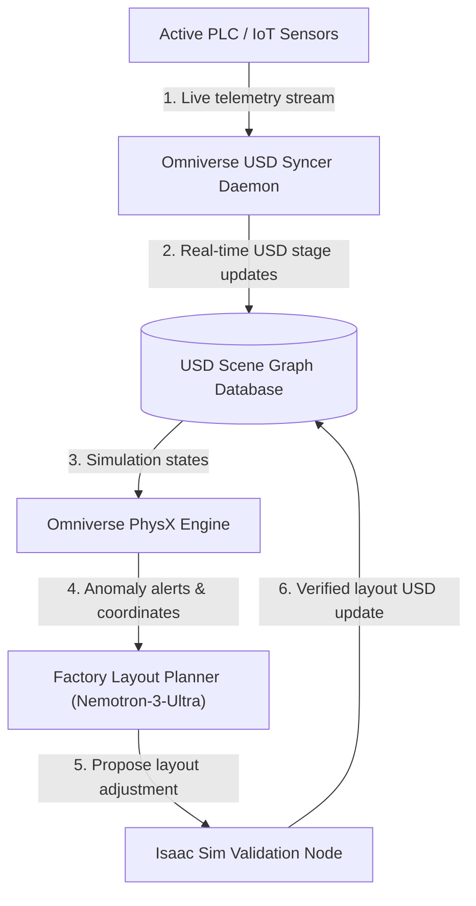
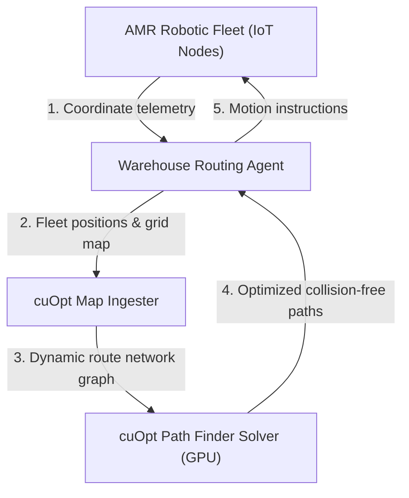
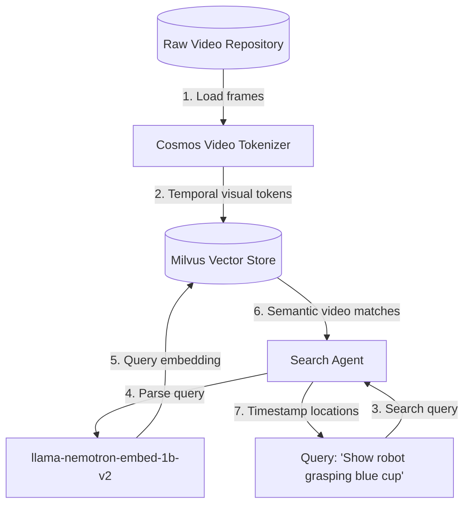
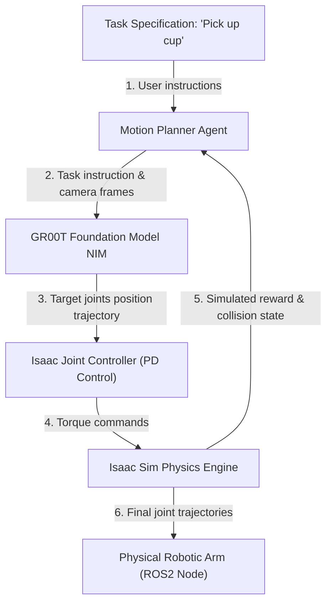
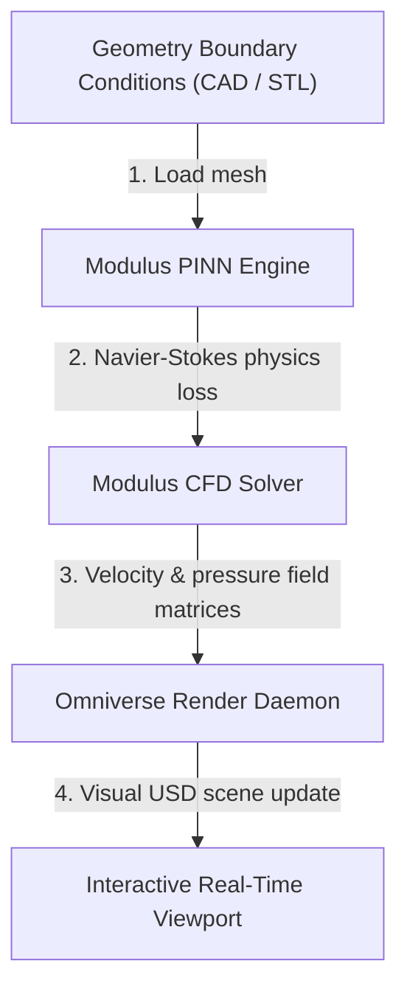

# TokenGateKeeper: Physical AI & Robotics Blueprints Specification (Deep Dive)

This specification details the physics engines, CAD-USD converters, multi-agent robotic controllers, and telemetry pipelines for NVIDIA Physical AI & Robotics Blueprints.

---

## 1. NVIDIA Omniverse DSX Blueprint for AI Factory Digital Twins

### 1.1 Technical Objective
To automate the real-time synchronization, physics-aware simulation, and predictive layout optimization of robotic factories using NVIDIA Omniverse, USD (Universal Scene Description), and the PhysX physics engine.

### 1.2 System Architecture & Container Topology



### 1.3 Container Specifications & Environment Variables
*   **`omniverse-usd-syncer`**: Industrial IoT bridge converting sensor signals (MQTT/Kafka) to USD attributes.
*   **`physx-sim-node`**: GPU-accelerated PhysX physics engine container.
*   **`isaac-sim-validator`**: Headless validator checking collisions and robot kinematics.

```yaml
SERVICES:
  USD_STAGE_PATH: "/data/factory_stage.usd"
  IOT_STREAM_URL: "kafka://localhost:9092/telemetry"
  RENDER_ENGINE: "RTX_PATH_TRACING"
```

### 1.4 Step-by-Step Pipeline Flow
1.  **Telemetry Capture**: Live IoT and PLC data from conveyor belts and robotic arms stream into the `omniverse-usd-syncer`.
2.  **USD Syncing**: The syncer dynamically updates the universal scene graph attributes matching spatial locations.
3.  **Physics Check**: The `physx-sim-node` computes collision vectors and forces to alert of physical anomalies.
4.  **Layout Analysis**: If a bottleneck is detected, `nemotron-3-ultra-550b-a55b` proposes layout adjustments.
5.  **Simulation Check**: The proposed adjustment is tested in `isaac-sim-validator` to ensure robotic range-of-motion.
6.  **Stage Application**: The validated configuration is written back to the master USD database.

### 1.5 API Schema & JSON Payload
*   **Endpoint**: `POST http://localhost:8085/v1/digital-twin/sync`
*   **Request JSON**:
    ```json
    {
      "usd_stage": "/data/factory_stage.usd",
      "iot_payload": {
        "robot_id": "arm_04",
        "coordinates": {"x": 12.5, "y": 4.2, "z": 1.8},
        "status": "active"
      }
    }
    ```
*   **Response JSON**:
    ```json
    {
      "sync_status": "success",
      "collision_detected": false,
      "updated_nodes": ["/root/arm_04/joint_2"]
    }
    ```

### System Prerequisites & Minimum Requirements
*   **Hardware Requirements**:
  * At least 1x NVIDIA RTX GPU with 48GB VRAM (e.g. RTX 6000 Ada or L40S), 64GB RAM, 16 CPU cores.
*   **OS Requirements**:
  * Ubuntu 22.04 OS
*   **Software Requirements**:
  * Omniverse Kit Launcher, Docker with Compose v2, NVIDIA Container Toolkit

---


## 2. Multi-Agent Intelligent Warehouse

### 2.1 Technical Objective
Coordinating fleets of autonomous mobile robots (AMRs) using GPU-accelerated routing engines (cuOpt) to prevent collision courses and plan paths under live obstacle modifications.

### 2.2 System Architecture & Container Topology



### 2.3 Container Specifications & Environment Variables
*   **`amr-telemetry-collector`**: Gathers location vectors and battery metrics from warehouse robots.
*   **`cuopt-routing-engine`**: Connects routing coordinates to the cuOpt solver interface.

```yaml
AMR_CONFIG:
  MAX_FLEET_SIZE: "250"
  SOLVER_TIME_LIMIT_MS: "500"
  GRID_RESOLUTION: "0.1"
```

### 2.4 Step-by-Step Pipeline Flow
1.  **Fleet Logging**: AMR robots continuously report coordinates and payload weights to the collector.
2.  **Obstacle Mapping**: Sensors map static and temporary obstacles into a spatial occupancy grid.
3.  **Graph Construction**: The grid is formatted as a route network graph.
4.  **cuOpt Solving**: The graph is sent to `cuOpt Solver` which calculates path combinations in parallel on GPU.
5.  **Execution Routing**: The optimal paths are sent to the AMR fleet controller.

### 2.5 API Schema & JSON Payload
*   **Endpoint**: `POST http://localhost:8085/v1/warehouse/route`
*   **Request JSON**:
    ```json
    {
      "fleet": [
        {"id": "amr_1", "start": [0.0, 0.0], "end": [24.0, 18.5]}
      ],
      "dynamic_obstacles": [
        {"id": "block_A", "bounds": [[10.0, 10.0], [12.0, 12.0]]}
      ]
    }
    ```
*   **Response JSON**:
    ```json
    {
      "routes": {
        "amr_1": [
          [0.0, 0.0], [5.0, 0.0], [10.0, 5.0], [24.0, 18.5]
        ]
      },
      "routing_time_ms": 12.4
    }
    ```

### System Prerequisites & Minimum Requirements
*   **Hardware Requirements**:
  * Expect that you will want the NIM microservices to be self-hosted as you progress in your development. For self-hosting the blueprint with these microservices locally deployed, the recommended system requirement is 4 H100 GPUs with the Llama 3.3 Nemotron Super 49B NIM (primary LLM), Nemotron Nano 12B, the NV-EmbedQA 1B, embedding NIM, NeMo Retriever and NeMoRetriever OCR NIMs for document processing, and the Milvus database accelerated with NVIDIA cuVS.
*   **Deployment Options**:
  * Docker compose

---


## 3. Cosmos Dataset Search

### 3.1 Technical Objective
Indexes massive video training repositories using Cosmos video tokenizers to enable spatial-temporal keyword search and auto-labeling.

### 3.2 System Architecture & Container Topology



### 3.3 Container Specifications & Environment Variables
*   **`cosmos-video-tokenizer`**: Segments video archives into sequence embedding files.
*   **`dataset-search-agent`**: Ingests visual prompts and returns matching files.

```yaml
COSMOS:
  TOKENIZER_MODEL: "cosmos-v1-tokenizer"
  GPU_DEVICES: "0"
```

### 3.4 Step-by-Step Pipeline Flow
1.  **Video Ingestion**: Video files are parsed and segmented into temporal arrays.
2.  **Feature Encoding**: The frames are encoded into sequence tokens using the Cosmos Video Tokenizer.
3.  **Indexing**: The output tokens are written to a Milvus Vector Database.
4.  **Semantic Search**: The user query is embedded and matched against the database.
5.  **Timelines Output**: The agent returns matching segments and timestamp offsets.

### 3.5 API Schema & JSON Payload
*   **Endpoint**: `POST http://localhost:8085/v1/dataset/search`
*   **Request JSON**:
    ```json
    {
      "query_string": "autonomous vehicle approaching intersection at night",
      "dataset_id": "av_logs_2026",
      "limit": 3
    }
    ```
*   **Response JSON**:
    ```json
    {
      "results": [
        {
          "video_path": "/data/videos/av_log_09.mp4",
          "timestamps": [14.2, 18.5],
          "similarity_score": 0.892
        }
      ]
    }
    ```

### System Prerequisites & Minimum Requirements
*   **Hardware**:
  * Standalone Deployment
  * H200, H100, H20
  * A100
  * L40S, L4, L20
  * Kubernetes
  * Inference:
  * 
  * H200, H100, H20
  * A100
  * L40S, L4, L20
  * 
  * 
  * 
  * Indexing:
  * 
  * CUDA version 11+
  * H200, H100, H20
  * A100
  * L40S, L4, L20
  * 
  * 
  * 
  * Search:
  * 
  * GPU not required
  * Note: B100, GB200, RTX 6000 are not yet supported by the blueprint.
  * For the most up to date information refer to Blueprint Docs page.
*   **Software**:
  * Operating System: Ubuntu 20.04 or newer
  * NVIDIA Driver version: 535 or newer
  * NVIDIA CUDA® version: 12.4 or newer
  * NVIDIA Container Toolkit version: 1.15.0 or newer
  * Docker version: Docker version 26 or newer
  * Python Version 3.11+

---


## 4. AI Weather Analytics with Earth-2

### 4.1 Technical Objective
Generates global weather predictions using CorrDiff and FourCastNet models, enabling localized environmental risk simulation.

### 4.2 System Architecture & Container Topology

```mermaid
graph TD
    Obs[("Global Climate Data Store")] -->|1. Boundary conditions| FourCastNet["FourCastNet Global Model NIM"]
    FourCastNet -->|2. Coarse global forecast data| CorrDiff["CorrDiff Downscaling NIM"]
    CorrDiff -->|3. High-resolution local weather (2km grid)| RiskEngine["Risk Analysis Simulator"]
    RiskEngine -->|4. Precipitation, wind hazard probabilities| AlertAgent["Climate Telemetry Agent"]
    AlertAgent -->|5. Regional alerts| Obs
```

### 4.3 Container Specifications & Environment Variables
*   **`fourcastnet-forecast-nim`**: Predicts global weather variables.
*   **`corrdiff-downscale-nim`**: Downscales coarse resolutions to a 2km grid.

```yaml
EARTH2:
  FORECAST_HORIZON_HOURS: "120"
  DOWNSCALE_REGION: "US_EAST"
```

### 4.4 Step-by-Step Pipeline Flow
1.  **Boundary Load**: Coarse boundaries from meteorological datasets load into the model.
2.  **Global Simulation**: `FourCastNet` generates global weather forecasts.
3.  **Downscaling**: `CorrDiff` resolves regional patterns on a 2km grid.
4.  **Risk Assessment**: The risk engine calculates precipitation and wind hazard probabilities.
5.  **Alert Dispatch**: Regional alerts are logged to the climate telemetry system.

### 4.5 API Schema & JSON Payload
*   **Endpoint**: `POST http://localhost:8085/v1/weather/forecast`
*   **Request JSON**:
    ```json
    {
      "coordinates": {"lat": 35.6895, "lon": 139.6917},
      "parameters": ["precipitation", "wind_gust"],
      "forecast_hours": 48
    }
    ```
*   **Response JSON**:
    ```json
    {
      "forecast": [
        {
          "hour": 24,
          "precipitation_mm": 12.5,
          "max_wind_ms": 14.8,
          "risk_index": 0.35
        }
      ]
    }
    ```

### System Prerequisites & Minimum Requirements
*   **General**:
  * Hardware Requirements
  * GPU: L40S, A6000
  * RAM: 32 GB
  * CPU: x86-64 architecture, 8 Cores (Intel Core i7 (7th Generation) or AMD Ryzen 5)
  * Storage: 64 GB
  * Software Requirements
  * OS: Ubuntu 22.04
  * Deployment: Kubernetes
  * There are multiple deployment configurations that may require more compute
  * requirements. For example, full deployment of the Omniverse application and NIM on the
  * same machine will require 2 GPUs. For complete details, see the blueprint
  * documentation on Github.

---


## 5. Synthetic Manipulation Motion Generation for Robotics

### 5.1 Technical Objective
Generate joint trajectory motion arrays for robotic arms and humanoids using Isaac Sim and GR00T foundation models.

### 5.2 System Architecture & Container Topology



### 5.3 Container Specifications & Environment Variables
*   **`groot-motion-nim`**: Generates joint trajectories from physical observations.
*   **`isaac-physics-sim`**: Environment rendering and verification system.

```yaml
GR00T:
  ROBOT_TYPE: "humanoid_manipulator"
  ROS2_BRIDGE_ENABLED: "true"
```

### 5.4 Step-by-Step Pipeline Flow
1.  **Task Specification**: High-level commands and camera frames are input to the motion planner.
2.  **Trajectory Generation**: `GR00T` generates target joint positions.
3.  **PD Control Validation**: The joint commands are translated into torques and verified in `Isaac Sim`.
4.  **Collision Check**: The simulator checks for collisions and kinematic errors.
5.  **Physical Deployment**: Verified joint coordinates are sent to the ROS2 robotic arm node.

### 5.5 API Schema & JSON Payload
*   **Endpoint**: `POST http://localhost:8085/v1/motion/generate`
*   **Request JSON**:
    ```json
    {
      "task": "place_block_on_target",
      "camera_frame": "/data/frames/frame_01.jpg",
      "joint_positions": [0.0, 0.0, 0.0, 0.0, 0.0, 0.0]
    }
    ```
*   **Response JSON**:
    ```json
    {
      "status": "success",
      "trajectory": [
        [0.0, 0.1, 0.2, 0.5, 0.1, 0.0]
      ],
      "execution_time_sec": 4.5
    }
    ```

### System Prerequisites & Minimum Requirements
*   **General**:
  * Hardware Requirements
  * GPU
  * NVIDIA 6000 Ada, 4090, 5090,  L40, L40S, L20 and A40 or any higher level NVIDIA RTX™-capable GPU
  * Cosmos - HGX node (1x H100) TBD
  * CPU
  * Intel Core i7 (7th Generation)
  * AMD Ryzen 5
*   **OS Requirements**:
  * Ubuntu 22.04 OS
  * Windows 11

---


## 6. Build a Digital Twin for Interactive Fluid Simulation

### 6.1 Technical Objective
Simulates high-fidelity real-time CFD (Computational Fluid Dynamics) datasets on GPUs using Modulus PINNs (Physics-Informed Neural Networks).

### 6.2 System Architecture & Container Topology



### 6.3 Container Specifications & Environment Variables
*   **`modulus-pinn-solver`**: Physics-informed neural network solving Navier-Stokes equations on GPUs.
*   **`omniverse-fluid-renderer`**: Interactive rendering node translating velocity matrices to Omniverse scenes.

```yaml
FLUID_SIM:
  PINN_MODEL_PATH: "/models/cfd_pinn.pt"
  REYNOLDS_NUMBER: "10000"
```

### 6.4 Step-by-Step Pipeline Flow
1.  **Mesh Loading**: The CAD boundary files are loaded and prepared.
2.  **CFD Solving**: The `modulus-pinn-solver` runs physics losses on the boundaries.
3.  **Matrix Export**: The solver outputs velocity and pressure field matrices.
4.  **Visual Render**: The `omniverse-fluid-renderer` visualizes the fluid vectors in real time.

### 6.5 API Schema & JSON Payload
*   **Endpoint**: `POST http://localhost:8085/v1/simulation/cfd`
*   **Request JSON**:
    ```json
    {
      "cad_model_path": "/data/mesh/wing_profile.stl",
      "inlet_velocity_ms": 45.0,
      "fluid_density": 1.225
    }
    ```
*   **Response JSON**:
    ```json
    {
      "drag_coefficient": 0.024,
      "lift_coefficient": 0.451,
      "output_render_path": "/data/renders/wing_flow.usd"
    }
    ```

### System Prerequisites & Minimum Requirements
*   **Hardware Requirements**:
  * The real-time wind tunnel blueprint supports the following hardware:
  * At least 2x RTX™ GPUs with at least 40GB of memory each, e.g., 2xL40S or 2xA6000
  * 128GB RAM
  * 32 CPU Cores
  * 100 GB Storage
*   **OS Requirements**:
  * Linux - Ubuntu 22.04 or 24.04
*   **Software Requirements**:
  * Git: For version control and repository management.
  * Git Large File System (LFS): For large files that are too large to efficiently store in a Git repository.
  * Python 3: For scripting and automation.
  * Docker: For containerized development and deployment. Ensure non-root users have Docker permissions.
  * NVIDIA Container Toolkit: For GPU-accelerated containerized development and deployment. Installation and configuring docker steps are required.
